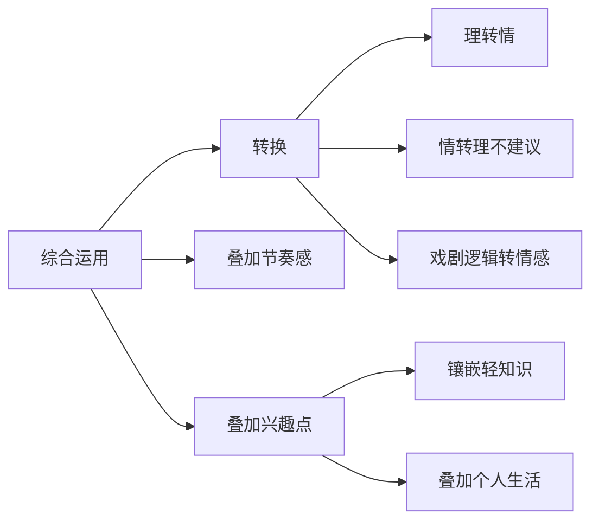
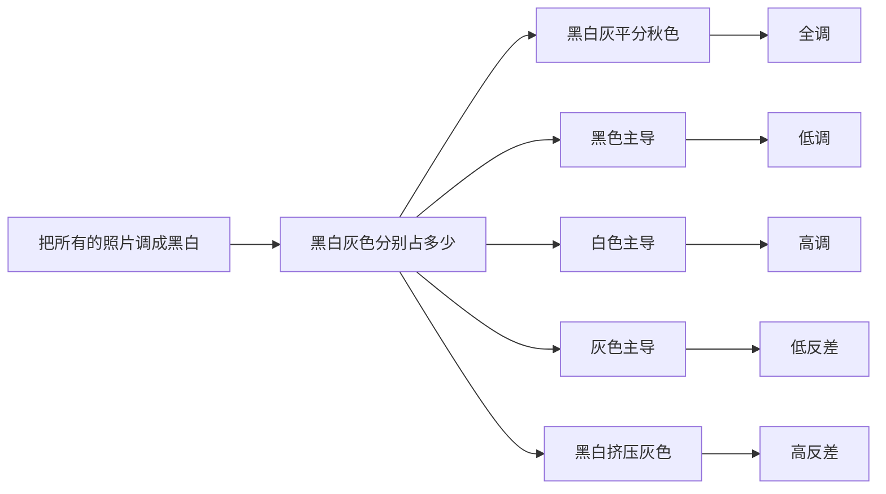
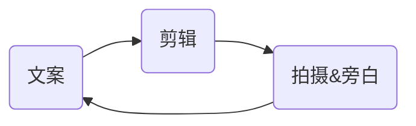
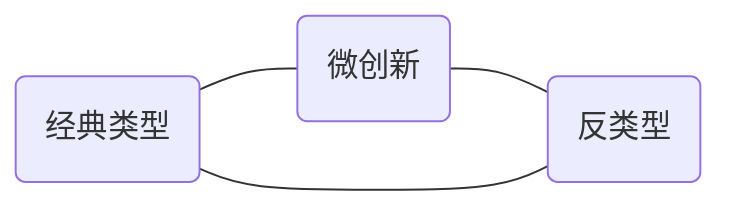

---
{"title":"🎥️ 2023-07-19 第一人称短视频创作","tags":["🧠️/📥️/🎥️/🟩️"],"dg-publish":true,"aliases":null,"created":"2023-07-19 14:21:29","updated":"2023-08-14 02:42:03","permalink":"/Cards/🎥️ 2023-07-19 第一人称短视频创作/","dgPassFrontmatter":true}
---

- Title :: 🎥️ 2023-07-19 第一人称短视频创作
- Type :: [[Cards/🎥️\|🎥️]]
- Tags ::
- Author ::
- URL ::
- Reference ::
- Publish Date ::
- Reviewed Date :: 2023-07-19
---

# 课程目录

- 01.常用运镜技巧-酷炫类U型运镜.mp4
- 02.一个人如何给自己拍大片.mp4
- 03.常用运镜技巧-呈现式运镜.mp4
- 04.常用运镜技巧-蚂蚁视角运镜.mp4
- 05.常用运镜技巧-跟随运镜.mp4
- 06.【3.0版本】极简进阶思维课：策划和定位思维.mp4
- 07.课程前言.mp4
- 08.0-2一场重要的直播课.mp4
- 09.1-1-热门的前提：平台机制与算法.mp4
- 10.2-1-普世：需求的寻找和确认.mp4
- 11.2-2-陌生化：演绎、并置和转化.mp4
- 12.直播精选回放：选题真简单.mp4
- 13.直播精选回放：内容变现和视频策略.mp4
- 14.3-1-建立结构意识.mp4
- 15.3-2-18个流量密码和2种钩子.mp4
- 16.3-3-骨架搭建：五种持续抓住观众的方法.mp4
- 17.精选直播回放：从骨架到选题思路.mp4
- 18.3-4-情绪刺点：提高数据的筹码有多少.mp4
- 19.3-5-结构与流量控制.mp4
- 20.3-6-付费链路：刺激购买的秘密.mp4
- 21.3-7个性化表达：击碎心灵的字词句.mp4
- 22.3-8-优化信息密度-控制时间的沙漏.mp4
- 23.加餐：信息特性再讲.mp4
- 24.加餐：重点讲解切片性.mp4
- 25.3-9-抖音式交流：处境与腔调、姿态与立场.mp4
- 26.4-1-穿越千年的故事原理.mp4
- 27.4-2-故事的5种实践.mp4
- 28.4-3创作构思的基本流程.mp4
- 29.直播精选回放：设置人物欲望和自我暴露.mp4
- 30.直播精选回放：故事化的演练之设置障碍.mp4
- 31.5-1重力的表达：构图的平衡、对比和张力.mp4
- 32.5-2焦段：寻找不同的穿透力.mp4
- 33.5-3-光！光！光！.mp4
- 34.5-4-色彩的秩序.mp4
- 35.6-1-情境的表达：人与世界的关系构建.mp4
- 36.6-2-空间的表达.mp4
- 37.6-3-物的表达：质地、肌理与材料表达.mp4
- 38.6-4-人的表达：面孔、肢体、声音与镜头表现力.mp4
- 39.6-5-画幅比：横竖屏的选择.mp4
- 40.6-6-剪辑基础思维.mp4
- 41.6-7--实践：构建影像化思维.mp4
- 42.6-8-形象种子、形式支点和影像系统.mp4
- 43.7-1视角与距离.mp4
- 44.7-2-深入影像的视角与距离.mp4
- 45.8-1-时间和节奏.mp4
- 46.8-2-深入影像的时间与节奏.mp4
- 47.9-1-流量思维：账号、视频和变现.mp4
- 48.9-2-账号策划与差异化的五个维度.mp4
- 49.9-3-起号、迭代与转型：不同阶段的运营策略.mp4
- 50.创作思维直播课之十一项作业（一）.mp4
- 51.创作思维直播课之十一项作业（二）.mp4
- 52.创作思维直播课之十一项作业（三）.mp4
- 53.加餐：结构再讲.mp4
- 54.1摆地摊逻辑的短视频.mp4
- 55.2同城引流如何找卖点.mp4
- 56.3同城引流的直播间打造.mp4
- 57.4抖音本地生活商业生态.mp4
- 58.日常分享与vlog专题课：类型、选题和切入点.mp4

# 一场重要的直播课

> [!Quote]
> - 吸收不是靠听、**靠练**。
> - 学——忘——尽情创作——回忆——修改——发——十条之后总结

## 渐进创作
- 碎片化想法，即兴地写作，写下不同时间迭代的信息。
- 找到了需求（*对于观众有价值*）和陌生化的点再定稿。
- 闪念就是你的想法，你的想输出的内容，你的写作内容，随便写，抽象也无妨，尽情创作。
- 善用 xxx 建立骨架，渐进创作。
- 自上而下的时间线，看见思考的过程。
- 每一个闪念都可能是一个选题。
- 创造利他的内容。

## 步骤
- 需求确立 陌生化（新概念命名）
- 搭建骨架
- 预埋情绪刺点
- 梳理文字的信息密度
- 雕琢文字 （修辞手法）

## 需求挖掘
1. 普遍化思考：人类的共同欲望
2. 个体化思考：具体情境化思考
3. 个人化思考：自我观察
4. 数据化思考：参考热点构建选题清单

> [!Quote]
>  - 所有的物质，不过是心灵交换的媒介。一个作品，如果没有背后的感性成分，那不过是物质材料的简单组合。蒙娜丽莎如果没有背后的作者的心灵，那么就只是一堆色粉。
> - 一边是**自己**，一边是**他人**。

> [!Question]
> - 赌注是什么？
> - 牌面是什么？
> - 你要怎么打？

# 极简进阶思维课：策划和定位思维

> [!Tip] 这是需要做决策的一节课
> - 问题思考必须**颗粒化**，不轻易全盘否定不随便说找不到方向。

> [!Question] 常见问题
> 1. 老师，我什么优势都没有，迷茫没有方向
> 2. 老师，我什么都能做，找不到最应该做的
> 3. 老师，烧烤店怎么定位？
> 4. 老师，服装怎么做？
> 5. 老师，我做了女性成长，我以后能带货吗？
> 6. 老师，我是做口播赛道还是做情感分享？
> 7. 老师，我应该选择怎样的人设？

> [!Tip] 你是谁？听哪部分？怎么听？用到哪？
> 1. 你没时间做内容，着急出单赚钱，只想做好物分享/同城引流，大力出奇迹，不需要差异化，只需要把短视频做好
> 2. 有特定变现需求，想做差异化定位（差异品牌调性），需要定位差异才可以突破，（品牌）认可才可以成交的。
> 3. 没有必须的变现路径，想要谋求长久事业发展，更多的可能性的人

> [!Quote] 拿来主义：拿部分的知识做自己的什么事。（自己的根本目的）

> [!Question] 怎么做抖音？怎么找方向？怎么定位？
> 1. 变现基本路径
> 2. 如何使用流量
> 3. 账号定位
> 	1. 人群
> 	2. 价值
> 	3. 类型
> 	4. 影像系统
> 	5. 人设
> 1. 单点思维

## 🟥️变现路径
1. 拿着产品找流量
	1. 拿着成熟产品**找流量**
	2. 拿着完整项目找流量
2. 拿着流量找产品
	1. 围绕人群做管量**卖别人的产品**
	2. 围绕人群做流量**卖自己的产品**
3. 注意
	1. 接广告对大多数来说应该是**额外收入**
	2. 直播带货对于大多数来说应该是**效率低** 、 **成本大**
	3. 比起好赛道，我们不如问自己**能驾驭什么赛道**，**擅长和什么人群**打交道

> [!Tip] 抖音的价值：打破时间和空间的限制

> [!Tip] 二选一的决定：**摆地摊**逻辑和**买手店**逻辑

## 流量逻辑

### 买手店逻辑
1. 常见类型
1. 个人 IP
2. 缺点：见效慢、可能半年都不变现、对人的综合素质偏高
3. 优点：选题自由、变现自由、转型自由、粉丝粘性高、流量相对稳定
4. 整体策略：
	1. 忘记产品，视抖音为**社交**平台
	2. 记住！**职业身份**只是生活的一个侧面
	3. 有才华展示**才华**、没才华展示**品行**
	4. 选题自由但**人群**和**价值**要**垂直**

### 摆地摊逻辑
1. 常见类型
	1. 无人设的书单号、好物分享
	2. 同城引流、团单售卖
	3. 蓝 V 自播
2. 缺点：偏体力、干一条是一条、没有时间的复利、流量波动大
3. 优点：见效快、单条视频的成本低、可大规模复制
4. 整体策略：
	1. **每条转化**，不求涨粉、点赞等数据
	2. 不要增加用户的**使用成本**（*直接挂车、挂电话*）
	3. **流量密码**充分运用
	4. 跑通一条后**批量复制**
	5. 多账号**复制**
	6. 多维度**截流**
	7. 用**付费推广**增效

> [!Tip] 和空间做生意：提高组织效率低成本复制

> [!Tip] 选择要素
> 1. 决策成本
> 	1. **客单价**
> 	2. **刚需**还是**非刚需**
> 	3. **标品**还是**非标品**
> 2. 心性（*坚持*）
> 3. 目标

> [!Tip] 每条视频只有两个作用
> 1. 当下**转化**（逼单）
> 2. **营销**自己（未来转化）

## 垂直问题
> [!Question]
> - 我们为什么害怕不垂直？
> 	- 影响流量？
> 	- 影响变现？

> [!Question] 什么是价值垂直？
> - 所有的商品都在抚慰痛点、解决问题
> - 我们购买的是商品背后的价值

> [!Abstract] 账号&价值
> - 选择在特定的人那购买
> - 要么相信的是**品牌**提供的价值
> - 要么是我因为把对这个**人的信任**转移到商品上
> - 或者只是因为你**刚好出现**了

### 赛道垂直<价值垂直
- 赛道垂直并非不对，除非你很强大的卷
- 赛道垂直会让同质化然后竞争极其残酷
- 赛道垂直容易导致滑入天天打广告的陷阱
---
- 所有的商品都满足价值需求
- 所有的账号都聚集一群有价值需求的人
- 自己创造转化价值或者链接有产品的人

### 精准是个相对概念
1. 价值无关 无关人群
2. 价值相近 潜在付费
3. 价值匹配 可以付费
4. 价值信任 强烈付费（*专业度*）

> [!Tip] **漏斗模型**不仅是账号流量的模型，也是一条视频的模型。

### 垂直
- 必须垂直，但不是全部精准
- 必须垂直，但是选题不能太狭隘在产品介绍
- 必须垂直，但是不要盯着赛道做垂直（**人群和价值垂直**）

> [!Tip] 价值垂直后的好处
> - 我们拥有了更多的**选题的自由**，选那些更容易爆的
> - 我们拥有了更多的变现的自由选那些**变现性价比更高**的你更热爱的

> [!Example] 同一个价值可以对应不同的商品
> - 美：
> 	- 提供变美的商品
> 	- 提供变美的课程
> 	- 提供变美的社群

### 价值垂直<兴趣垂直
- 我在丽江的故事
	- 节目表演（学打鼓 然后卖货） → 知识付费
- 同理
	- 通过利他的内容 → 产品

> [!Example] 烧烤店面对的人不一定是很饥饿的人，而是激发大家吃一顿的念头，服装不一定要介绍服装，而是激发大家爱自己打扮自己的念头。

> [!Hint] 比起想以自我为中心的想——我发什么内容能赚钱，不如换换角度想——我在**给谁做内容**。
> - **培养**兴趣内容变现
> - **潜在用户**比目标用户更应该是假想敌

> [!Quote] 所有的需求都是被精心设计出来的
> - 赛道垂直<价值垂直<兴趣垂直

> [!Warning]
> - 短视频的发布效率高
> - 直播间的转化效率高
> - 直播间流量相对比较贵 做大流量相对困难
> - 短视频流量相对比较便宜 做大流量相对简单
> - 不用把所有环节都放在短视频里
> - 短视频越不功利越有机会拿到大流量
> - 短视频和直播综合运用，而非缺一条腿走路

## 账号策略

### 账号定位>人设
- 能力迁移提供不同价值

> [!Example] @大厂产品经理
> - 人生成长，产品思维经营人生
> - 教职场规划
> - 教设计变现产品

> [!Example] @不婚女性
> - 经济独立，精神独立的成长干货
>
> - 和同为不婚或离婚人，生互相取暖与激励
> - 让人佩服

> [!Tip] 你以为的你是谁，并不决定你一定做某种类型的账号。

## 定位步骤

### 账号定位=价值X人群X类型X影像系统X人设
- 差异化的账号定位=**特殊的价值**提供者
- 差异化的账号定位=价值的**特殊提供**者

### 价值 X 人群
- 人群和价值的确定往往直接相关变现的方向
	- 不要抛开人群谈价值，不要抛开价值谈人群
	- 一体两面
		- 人群
		- 价值
- 每一个商品对应不同人群都有不同的价值
	- 服饰
		- 日用品
		- 自我实现
		- 礼品
- 不同人群的不同阶段有不同的需求，不同阶段的需求会发生转变，就连心情和观看习惯都会改变
	- 他不是想当然的一个粉丝和数据，务必是**具体**，务必**有血有肉**，必须当下有自己的**名字、身份和生活细节**。

> [!Tip] 你的“张小羊
> - 受教育水平
> - 经济水平和消费水平
> - 每天的生活状态和生活节奏
> - 婚烟家庭状态、恋爱状态
> - 他愿意付费的价值和购买力
> - 有的时候认某一个死理也是一个人群
> - 平时刷视频的习惯
> 	- 例如：书单类大部分是为平时没有阅读习惯为了缓解阅读焦虑的人提供的平时有看书习惯的人可能会选择以书找书并不会因为抖音的推荐而去选择书
> 	- 例如：针对知识类的账号男女生因为思维回路和思维模式的差异大部分男生更喜欢信息密度很高的知识而女生则喜欢信息密度没那么高的知识
> 	- 例如：大多数高管因为已经具备了管理类知识所以刷抖音时会更喜欢去看财经类或者舞蹈等泛娱乐化的知识反而是刚进入职场的小白才会爱看这些偏管理类的知识
> - 此时此刻正在关心的问题

> [!Tip] 谁都不懂，你先从**懂自己**开始
> - 不定义**具体的人**，极其容易陷入自嗨的状态
> - 定义具体的人，一切都可以把握一切都有判断标准

#### 角度1：常规价值 明确简单目标（价值落地）
- 产品：生理/安全/社交需要/尊重/自我实现
- 项目：参加加提供赚钱的机会
- 资源：中介提供线索
- 特殊领域的知识
	- 教技能——摄影师的知识付费
	- 转化成服务或者产品——摄影师的私人定制
	- 个人综合——摄影师的眼光看世界
	- 不一定要最专业，但是要最懂你的用户——觉得自己什么都不的人——只往下看，只往上看，只在圈内看
- 兴趣爱好：**生活的美好**或者恰好**对应别人的需求**
- 令人羡慕的生活：精神支撑
- “通俗意义上”的不好的"经验
	- 亏了一个亿的经验也值得分享
	- 那怕是你自己的缺路如何解决这些问题（糖人）
- 精神态度——生活态度很美好
- 时间：做信息提供商——消磨时间/节省时间——读评论——读金句
- 找你喜欢的产品去带货——低卡零食等(相似人群的消费意见比 KOL 更可靠)

#### 角度2：垂直细分内卷
- **流程**细分
	- 定位、文案、脚本、拍摄、剪辑
- **行业**细分
	- 餐饮 (再细分一—烧烤店奶茶店
	- 美业（再细分）
- **年龄**细分
	- 提供如何进行00后职业规划、35岁转型职业规划
- **理念**细分
	- 追求性价比/品质感/服务80后审美或将95后审美
	- 端庄中式美/日式侘寂风/流行美式的好莱坞/贵族欧式英式

#### 角度3：**老场景**叠加**新价值**
- **醉翁之意**不在酒（具体叠加抽象）
	- 美食的关键不在于食物，而在于…
	- 旅行的关键不在于景点，而在于…
	- 数码产品的关键不在于功能，而在于…
- 线下店还可以和什么价值结合（你的场景中有什么美好的、疼痛的瞬间）
	- 烧烤店——友情、北漂
	- 律师所——婚姻、背叛
	- 旅行客栈——远方
	- 美业店——分手、女性励志

> [!Tip] 价值**叠加**
> - 不用非得二选一赛道
> 	1. 在健身房讲情感，在家里讲健身故事
> - 什么人非得盯赛道？
> 	1. 极其专业，吃饭的本事，敢和别人卷专
> 	2. 我就靠这个变现，我项目想得很清楚

#### 角度4：交叉迁移
- 确立**交叉**优势和**跨界**的能力迁移
	- 产品经理教人生规划
	- 英语配音演员教成年人英语
	- 财务教家庭理财
	- 魔术师教抖音
	- 导演教短视频

#### 角度5：深度洞察寻找蓝海商机
- 红海市场中还有没有消费者**没有被满足的价值**
- 还有那些“边缘”人群？(例如大码女装、中老年人抖音教学)
- 寻找**沉默的大多数**
	- 二本学生
	- 乖乖女
	- 老实人

#### 角度6：栏目化综艺化（壁垒高）
- 策划一个使命
	- 例如：有的综艺就是每天跟踪一个人回家，去到家里看他们的生活
	- 例如：和不同的帅哥拍照
- 参考来源
	- 电影
	- 电视节目(非诚勿扰、婆媳纠纷、今日说法、中国好声音、Boss访谈)
	- 书籍策划(电影药、文学治疗、情绪之书)

#### 角度7：综合价值：基于张小羊出发，瞄准一个人不必强行界定价值
- 长痘了怎么办
- 怎么和男朋友相处好好谈恋爱
- 怎么快速进入新行业学习
- 怎么适合自己职业
- 兴趣爱好怎么变成职业
- 毕业了去哪个城市
- 怎么减肥
- 和妈妈观念不合怎么办

> [!Tip] 从特殊到一般，一个人群的常态可能是另一个人群的特殊态。
> - 做自己
> - 照顾某个人
> - 追求某个人
> - 支持某个人

> [!Warning] 你的账号聚集了一批渴望某些事物人，这太可怕了。

> [!Tip] 人群→价值——双向奔赴
> - 谁说女性成长就一定给中年女性讲
> - 谁说爱与浪漫就必须是给年轻人讲
> - 谁说读书分享就必须给大学生讲
> - 谁说婆媳关系就必须给妻子讲

### 类型（*任何你能总结的都叫类型*）

### 影像系统（*你拍摄、剪辑能力强就有差异化*）
- 视觉
- 听觉
- 叙事腔调

> [!Tip] 根据自己的能力起点选择一个基本类型
> - 擅长拍摄或者镜头语言的——呈现型
> - 擅长文字表达的和语言表达的——讲述型

> [!Quote] 一种技术手段使用两次可称之为重复，一种技术手段使用三次甚至更多就形成了风格。
> - 深度使用鱼眼镜头？
> - 深度使用红色元素？
> - 深度使用讽刺语调？
> - 深度使用一镜到底？
> - 深度使用旁白混合？
> - 深度使用……

> [!Tip] 战略定位：必须走向一个**极端**（风格竞争力）
> - 精品大制作
> - 专业轰炸
> - 真诚交流

> [!Quote] 没有一种影像系统可以一直用下去

### 人设

> [!Question] 为什么要重视人设？
> - 比起谈论虚假的人设和刻意的个性，我更倾向于谈论个人化，我更倾向于谈论**你是谁**。

#### 个人化势在必行
- 因为赛道拥挤**同质化**（标签系统可破）
- 因为**商业气息过浓**（广告惹人生厌 软提及容易接受）
- 因为爆炸性增长红利消失（**人设强度** 深度信任）
- 因为**铁粉机制**限制（保持**新鲜** 可持续发展）

> [!Tip] 多元的身份
> - 观众是活生生的人
> - 你也是活生生的人
> - 你门同时拥有多元的社会身份

> [!Example] 条件越有限，创新越可能。（别人不做你能做）
> - 职业身份只是一种**信任背书**，只是生活的一个侧面
> 	- 美食老师
> 	- 律师爸爸
> 	- 美术妈妈
> - 商家场景只是一个**环境**，想想你的场景有什么疼痛、美好、趣味瞬间
> 	- 烧烤店——友情、北漂
> 	- 律师所——婚姻、背叛
> 	- 旅行客栈——远方
> 	- 工厂——耍花活
> - 赛道和类型只是**明线**，醉翁之意不在酒
> 	- 美食的关键不在于食物，可以在于家庭生活、情侣生活
> 	- 旅行的关键不在于景点，可以在于自我探索、而在于文化特性、而在于个人文采

> [!Tip] 人设强度、信任深度、情感浓度

#### 如何挖掘自己人格化都有哪些维度
1. 寻找身上的故事性
	- 你的**形象特征**和你有什么格格不入的地方？
	- 你的过去的**经历**中有什么**戏剧性**的地方？
	- 你的**履历**里是否有什么拿得出手的部分？
	- 你的**爱好和你的职业**有没有什么**分裂**之处？（@财经博主画画）
2. 质问自己的性格、品行、人格魅力
	- 共情力强，善于打动人
	- 虽然逻辑能力强，但讲话有温度
	- 行业资深，但是说话易懂
	- 身居高位然而特别没架子
	- 特别仗义
	- 特别疼老婆
> [!Warning] 危险！
> - 不要为了所谓的网感去做别人！
> - 越以一种**不想火的状态**出现越部容易火！（*真实感*）
3. 摆正自己的姿态确认和观众的关系
	- 提醒者
	- 服务者
	- 娱乐者
	- 领导者
	- 线上恋人
	- 私密知音
	- 萍水相逢的陌生人
> [!Tip] 不容易找到姿态的，要放在具体的场景中思考。
4. 梳理自己的三观你所认可的和你坚决反对的
	- 世界观
	- 价值观
	- 人生观
	- 审美观
	- 行业观
5. 你的愿望，你的渴望，你的目标（@张老九）

> [!Question] 啥也不是？
> - 人设其实是一个“情商”问题
> - 人设其实是一个“做人”问题
> 	- **自我暴露**弱者积极（乐观）
> 	- **向下亲切**地降维（亲切）
> 	- 提高能量层级，在视频中**活成自己想活成的样子**

> [!Tip] 救猫咪、弱者积极、强者示弱

> [!Tip] 关于人设
> - 🟥️再糟糕的人也可以通过励志招人喜欢
> - 发泄负能量即便有点赞也不会有人关注
> - 🟥️尊重观众不要以为观众就是傻叉
> - 首先真诚问自己喜不喜欢
> - 刻意讨好迎合所谓的抖音网感只会本末倒置
> - 我们总是在模仿别人
> - 我们总是在被改造成相似的人
> - 摘掉面具，坦诚做自己是很难的
> - 🟥️人设不仅是个人人设，也可以是人物关系的设定
> - 所以可以寻找一种有故事性的经合
> - 所以可以以组合身份确定一种关系
> - 所以可以共同提供世界观（即便内在有分歧）

#### 如何呈现人设
- 通过**形象**特征、所处**环境**
- 通过**说话方式**甚至**用词**习惯
- 通过**行为反应**和**处理问题的方式**和**展现出来的能力和性格**（讲故事叙事）
- 通过**所有短视频**共同形成的**感受**
- **直抒胸臆**(态度、目标、渴望、故事、经历、使命)

> [!Tip]
> - 学会**自卖自夸**是对别人时间的尊重
> - 露脸和人设没有关系

#### 没有人设两种误区
- 过度实用（赛道工具人）——用**理念**串联知识点、用**个人选择**推动故事
- 过度抽象（价值不落地）——找到**具体利他的内容**分享生活和价值观(*授课、采访、对话、事件、生活细节*)

> [!Tip] **价值必须落地**，格物才能致知。

## 运营策略

> [!Tip] 🟥️账号定位 = 价值 x 人群 x 类型 x 影像系统 x 你
> - **任意差异**就是差异；**叠加**也是差异

> [!Tip] 🟥️抖音定位=(价值2 X 人群2 X 类型2 X 影像系统2 X 人设2) X 流量使用逻辑 + 变现路径

### 如何规划短视频？
- 自下而上 **单点**思维——做视频 做账号（*火了一条再说*）
- 适时转化流量不以涨粉作为进度条的终点
- 单点思维不意味着一步登天的完美主义情结！（老师！我新号前三条视频什么流量都没有！）（*养号是为了喂养粉丝模型的标签和你的视频标签*）

> [!Question] 问：老师，我什么时候才是变现的时候？
> - 答：你的野心和你的时间成本

> [!Tip] 关于过程中的困难
> - 难还是易
> - 有的人再难也克服
> - 有的人必须确定性
> - 容易上手的做好一定难
> - 难上手的做出来一定牛

> [!Tip] 决断力 = 对**美好**的坚定 + 对**牺牲**的坦然 + **承担后果**的勇气

> [!Tip] 🟥️我有一个策略（*私人看法*）
> - **顺应我当下**的热爱、关心和状态
> - 我不同阶段有**不同阶段的关心事物**（接下来就是做好一条条短视频的事情了）

### 定位：课后作业

> [!Todo] 课后练习1:**自我阐述**
> 1. 身上的故事性
> 	1. 你的形象特征和你有什么格格不入的地方？
> 	2. 你的过去的经历中有什么戏剧性的地方？
> 	3. 你的履历里是否有什么拿得出手的部分？
> 	4. 你的爱好和你的职业有没有什么分裂之处？
> 2. 自己的性格、品行、人格魅力
> 	1. 共情力强，善于打动人
> 	2. 虽然逻辑能力强，但讲话有温度
> 	3. 行业资深，但是说话易懂
> 	4. 身居高位然而特别没架子
> 	5. 特别仗义
> 	6. 特别疼老婆
> 3. 摆正自己的姿态确认和观众的关系
> 	1. 提醒者
> 	2. 服务者
> 	3. 娱乐者
> 	4. 领导者
> 	5. 线上恋人
> 	6. 私密知
> 	7. 萍水相逢的陌生人
> 4. 你的三观
> 5. 你的愿望、你的渴望

> [!Todo] 课后练习2：定位**头脑风暴**

| 人群         | 价值 | 类型 | 影像系统 | 你  |
| ------------ | ---- | ---- | -------- | --- |
| “你的张小羊” |      |      |          |     |
|              |      |      |          |  身份   |

> [!Todo] 课后练习 3：三条视频的规划
> - 呈现之前的作业内容

# 热门的前提：平台机制与算法
- 建立**视频突围**思维而非账号思维
- 瞄准用户视频的所有元素都是特定**用户需要**的
- 尽可能提高自己**各项数据**
- 忘记算法**记住观众**

## 视频推送机制

### 抖音的核心工作
- 猜你想看什么（**观众兴趣爱好标签**）
	- 猜那条视频是你想要的（**视频标签**）
	- 猜这个作者是你爱看的（**创作者账号标签**）
- 用户协同（**观众兴趣爱好标签**）

> [!Tip] 视频逻辑而非账号主页逻辑
> 

## 标签系统
- 观众的兴趣爱好标签
	- 我们对每一条视频的反应
- 视频的视频标签
	- 视频的一切信息共同组成的”语素库'
- 创作者的账号标签
	- 所有的视频标签集合+为这个账号停留过的观众信息

### 视频标签库
- 语言信息
	- 标题
	- 字幕
	- 发布文案
	- 说的每一句话
- 视觉信息
	- 某些人的样子
	- 特定场合的识别
	- 特定长相风格和穿衣风格
	- 特定影调和色调
- 听觉信息
	- 口音
	- 具体音乐
	- 特定风格和节拍的音乐
- 用户信息
	- 特定地区
	- 评论热词

> [!Tip] 视频的**一切信息**共同组成的“**语素库**”

### 利用视频标签
- 标签不是简单粗暴的一两个词可定义的
- 你需要用什么元素让系统识别你的视频
- 考虑在这条视频下面最关键的、最强烈的、**最主导性的标签**是什么样子的？
	- 请你让所有的标签都往一个地方出力，别让你的视频推给可能会影响视频数据的那些人

> [!Tip]
> - 推送给合适的人
> - 是优质视频的前提

### 通过运营的方式强化标签
- 简单操作
- `#` 号的使用
	- 例如：#情感
	- 例如：#知识
	- 例如：#职场
- dou+投同类账号
	- 选择相似达人
	- 选择兴趣标签

> [!Tip]
> - 人不是冰冷的符号
> - 同一个人可以是不同账号的粉丝

> [!Tip]
> - 瞄准用户视频的所有元素都是特定用户需要的
> - 尽可能提高自己各项数据

## 赛马机制

### 赛道中赛马
- 互动数据：赞、评、转、藏、关注
- 停留数据：完播率、视频的平均停留时长、主页停留
- 粉丝数据：非粉丝的反馈>粉丝的反馈>铁粉的反馈
- 消费数据：直播间和带货视频转化率、直播间的礼物消耗、消费等级高的用户权重大
- 新鲜度：推新不推旧（*视频有生命周期*）

### 各数据的意义
- 总体而言数值是越高越好的
- 不同情况下的指标影响不一样
- 用高数据对抗新鲜度的下滑，直到彻底无法拯救

### dou+的5种用途
- 初期找到更多为你投票的评委
- 根据投入产出比扩大成果
- 强行转粉丝模型
- 快速拉热度

### 投放问题
- 早期
	- 窄范围
		- 投兴趣爱好
		- 投对标达人选择那些粉丝量小，并内容没自己好的
	- 长时间
		- 早期的策略是拉长时间让机器学习，越长时间越好
	- 靠自然
		- 铁粉机制不建议投涨粉，投相似用户群体的点赞评论，自然增长粉丝量
- 中期
	- 智能投放冲击高热度
	- 计算投入产出
- 后期
	- 精准打击精准破圈

### 铁粉机制
- 去同质化
- 加深用户和博主的联系，提高单个用户的价值
- 不需要更多的头部，保护新号
- 长远来看，门槛会越来越高

---

# 普世：需求的寻找和确认

> [!Question] 需求? 话题？ 主题?
> 选一个**需求**，进而选一个**话题**，并在话题中选**主题**。
> - 需求
> 	- 话题
> 		- 主题 1
> 		- 主题 2
> 		- 主题 3

> [!Question] 脱颖而出的办法？
> - 普世话题，陌生主题
> - 普世主题，陌生表达

> [!Question] 选题的基本原则？
> - 普世且陌生

> [!Summary] 《选题：从普世到陌生》单元目录
> - 普世化：需求的寻找和价值的确认
> - 陌生化：挖掘、聚焦、并置和转化

## 需求挖掘
- 普遍化思考：人类的共同欲望
- 个体化思考：具体情境化思考
- 个人化思考：自我观察
- 数据化思考：参考热点构建选题清单

### 普遍化思考：人类的共同欲望(人类共同渴望)
1. 好奇心：所有人对学习求知的渴望是不可抗拒的
2. 食物：对食物的饱腹占有欲望是人本能的正反合的自我辩论赛
3. 荣誉感（道德）：每个人都是“卫道士"
4. 被社会排斥的恐惧：这令人们被动自觉的遵守规矩
5. 性：弗洛伊德将其“清单”首位
6. 体育运动：运动的快感和对身体的操控
7. 秩序：对规律和确定性的渴望
8. 独立：对于自作主张的渴望
9. 复仇：有仇必报
10. 社会交往：渴望成为众人中的一分子
11. 家庭：与家人共享天伦之乐的欲望
12. 社会声望：对名誉和地位的渴望
13. 厌恶：对疼痛和焦虑的厌恶
14. 公民权：对服务公共和社会公正的渴望
15. 力量：希望影响他人

### 个体化思考：具体情境化思考
> [!Tip] 他不是我们想当然的一个人物，务必是具象的有血有肉，必须当下有自己的名字身份和生活细节。

- 有血有肉的个体
	- 受教育水平
	- 经济水平和消费水平
	- 每天的生活状态和生活节奏
	- 婚姻家庭状态、恋爱状态
	- 平时刷视频的习惯
	- ……

> [!Tip] 没有人是孤岛，不存在绝对特殊的需求。

- 真切关心的问题（是否有用）
	- 真切关心的问题
	- 他的急需和刚需是什么？能否升级成急需和刚需
	- 不同时期的热门情绪是不一样
	- 需要根据自己针对的人群画像去找到对应的普世价值

> [!Tip] 解决自嗨的最好方式：具体**情境化思考**

### 个人化思考：自我观察

> [!Tip] 深入分析自身产品和项目（价值点）

- 随时观察记录自己的生活
	- 生活中的闪光点
	- 感动点
	- 痛点
	- 矛盾点
	- 价值点
	- 体验点

> [!Tip] 总有一天你所记录的会和外部的热点结合

### 数据化思考：参考热点构建选题清单
- 构建选题清单
	- 同领域博主的热门话题

## 构建桥梁：让价值可被感知

### 陌生领域和知识
- 概念→现象
	- **解释现象**而不要解释知识（解决问题）

### 独特生活
- 独特的生活
	- 同样的衣食住行，不一样的地方在思

> [!Tip] 相似中去链接，对比中去感受

### 自己的感受
- 纵向的前因后果
	- 长期的积淀
	- 扳机
- 横向扩张
	- 情绪相似人群
	- 结论适用于什么人

> [!Tip] 选题需要：可感知且有需要
> - 共同的衣食住行
> - 共同的痛
> - 共同的渴望和需求
> - 共同的面越大，你的观众越多

## **确认价值**：真切地需要
- 观众处在哪个层级

- 真正为你点赞转粉的用户是谁？为谁站队？
- 观众的观看习惯

> [!Abstract] 真诚
> - 为了某种风格凹造型并不真诚
> - 自己都不明白自己的产品和观点好在哪为说而说并不真诚
> - 刻意卖弄自己的某种特殊经历和知识并不真诚
> - 觉得观众愚蠢而去刻意说一些自己都不想看的内容并不真诚
> - 觉得自己可以靠煽情说一些其实自己都不爱看的内容并不真诚
> - 不敢直面镜头呈现自己的面孔落落大方暴露在阳光之下并不真诚

# 陌生化：演绎、并置和转化

> [!Tip] 没有陌生化的选题是没有含金量的

## 偶遇可遇不可求的陌生
- 稀缺的景观：例如很好看的景色、从来没见过的大海、自己已造一个特殊的视觉效果
- 稀缺的情感：特别饱满的情感
- 稀缺的美好：例如极其稀有的美好的品质
- 稀缺的信息和资讯：财经博主
- 稀缺的奇闻异事：说书账号、电影账号
- 稀缺的事件：例如婆媳的剑拔弩张、街上抓眼球的事情、稀缺的故事

> [!Tip] 赋比兴
> - 赋就是铺陈直叙
> - 比就是类比，是其中最基本的手法，以彼物比此物
> - 兴，先言他物以引起所咏之词。

## 赋比兴
- “赋”——重铺陈和堆叠，是**演绎**具体的细节之美
- “比”——重在两者的**并置**，对立之美和结合之美
- “兴”——重在转化的过程，激发一种联想的**转化**之美

> [!Tip] 道生一、一生二、二生三、三生万物

## 演绎

### 演绎是一种**深度的聚焦**
- 组合情境：产品（价值）X人群X场景X痛点
	- 知识也是你提供的产品，要基于一个具体的应用场合
- **情绪拆分**演绎
- 展现生活要聚焦到一个**情境**

### 确认边界
- 月薪五万是高还是低
	- 限定到一个城市
	- 限定到一个年龄
	- 限定一类工作
- 北京的35岁互联网未婚男职员月薪是高还是低？
- 30岁南方女生如何解决起斑问题？

> [!Tip]
> - 确认边界：才能提高**针对性**、**专业性**和**可靠性**
> - 我们记住一个大唐盛世是因为我们记住了李白、杜甫和杨贵妃
> - 越**具体**，越能引发浩瀚的想象力
> - 越**聚焦**，越能激发对号入座的参与度

## 并置：对立和结合

### 对立
- 确立**二元对立**构建张力 最能达成精确和具体
> [!Tip]
> - 越是围绕着二元对立的对抗展，脚本越会有整体性越凝练
> - 观众越想知道答案，视频可看性越高，观众点赞评论都会越高，也会激发分享

### 结合之美
- 横向结合
	- **跨领域**结合
	- **热点事件**“碰瓷”（新角度）

> [!Tip] 我们习惯建立关系，而**新事物的碰撞**往往具备启发性和陌生感

## 转化

### 寻找支点
- 便利店女孩（小确幸）
- 粉红豹、安全帽

### 新概念：争夺命名权
- 寻找小众词汇（如其他国家或民族的语言）
- 反向使用
	- 贬词褒用/褒词贬用
- 比喻义
- 叠加创造新词
	- 耦合式恋爱
	- 生活颗粒度
	- 集体日记

### 创造生活
- 基于某个痛点或者美好的愿望
- 有限定（有要求）
	- 一百件浪漫的事情
	- 探一百家百元内的好店
	- 连续七天一直看书不看手机的生活实验
	- 利用身边的事物拍大片

> [!Tip]
> “演绎”、"并置”、“转化”——内容层面进行包装

### 从内容到影像：影像陌生化
- 旁白的风格化
- 帧率风格化（延时）
- 焦段风格化
- 色彩风格化
- 运动风格化

> [!Question] 每次选题之前必须问自己的3个问题
> - 你的**赌注**是什么？
> 	- 我**不得不看的原因**是什么？看完**能收获**什么？
> - 你有多少**胜算**？
> 	- 你提供的**价值**到底是什么？**独特**吗？
> 	- 价值不独特的话，你**陌生化**做得怎样？你用了演绎、并置还是转化？
> - 你要**怎么打**手上的牌？
> 	- 任何视频只要开始就会建立预期，你打算怎么**建立期待**？
> 	- 我们接下来就是要满足期待甚至给出超预期的惊喜，你如何**满足期待**？

> [!Tip]
> - 如果一条视频自己并不知道自己的赌注是什么就不要做
> - 如果一条视频所有的细节没有倾尽所有赢下这场博弈可能功亏一篑

---

# 建立结构意识

## 机器人"需要
- 完播率需要分秒必争
- 随时都要思考观众何时会滑走视频
- 结构是帮助我们提高完播率的重要因素
- 互动率需要我们以观众反馈和数据反馈为导向
- 需要我们围绕这些数据来设计我们的结构
- 好的结构能帮助我们清楚的表达
- 好的结构是和观众沟通的桥梁
- 好的结构能帮助我们调动观众的情绪

> [!Tip]
> - 两个对手：“机器人“ + "抖音人"
> - 我们必须主动走向观众

## 抖音人"观看场景需要
- 措不及防的“抖音人〞
- 精神涣散的”抖音人
- 记忆断裂的“抖音人〞
- 语言逻辑能力缺失的”抖音人〞

## 结构的三大成分
- 5秒完播率
	- 钩子
		- 流量捕捉
	- 钩子是抓住观众的原因，，可以是一句话，也可以是一个画面，可能是一个抽象的情绪
- 整体完播率
	- 骨架
		- 骨架保证观众持续观看，骨架保证观众理解主题并积累情绪，骨架是一股动力，而不是”八股文”式的模版
- 互动率
	- 情绪剌点
		- 流量沉淀
	- 情绪刺点分布在各个位置，可以在开头，可以在结尾，位置不定，数量不定。

# 18个流量密码

## 与我相关（调动观众的利己主义）
- 圈定人群
- 直接对话
- 主题暗示

## 撕开认知缺口（对未知的恐惧）
- 指出盲区
- 纠错
- 反常识
	- 质问存在的前提
	- 质问每个词的准确意义

## 挑衅（愤怒和骄傲）
- 强行捧踩某个人或者某个物品，让某个人成为队列里出列的人
	- 谁是xx
	- 为什么他是xx
- 自我吹嘘
	- 炫富

## 让观众居高临下（优越感和安全感）
- 犯傻、翻车
- 沙雕、土味
- 傻的不自知
- 暴露自我弱点
- 淳朴、单纯、简单
- 特别困难但是特别热爱生活
- 特别朴素但是却出口不凡

## 创造观看需求和购买动机（不满足 不够好）
- 痛点式包装
- 直接展示正向结果

## 人间美好（美和幸福）
- 特别灿烂的笑容
- 恋爱修成正果
- 奋斗终获成功
- 特别好看的景色
- 怀旧和追忆往昔

## 特殊消息（新鲜信息的获取）
- 好消息
- 独家消息
- 紧急消息与灾难预警
- 热议话题的讨论
- 新角度的理解
- 新名词和新概念

## 传奇故事（渴望成为传奇）
- 传奇人物的私生活
- 平凡人的英雄之旅

## 高情绪表达（天然的共情、好奇）
- 个人带着故事登场：肉麻、咆哮、痛苦、笑容
- 故事中的人与人之间的强冲突
- 哪怕只是简单的一句惊叹
	- 真刺激啊！
	- 这也太好吃了！

## 凑热闹（羊群效应）
- 人多热闹
- 围观群众
- 跟班

## 有趣（娱乐）
- 脑洞大开的尝试
- 有趣的挑战和实验
- 科普类的小话题

## 看故事（八卦）（偷窥欲）
- 独特的情境
- 陌生的故事
	- 人物关系陌生
	- 行为的不可能和不常见
	- 特殊生活的展示
	- 冲突的不可调和

## 反差和反转（猎奇）
- 画面中的反差
	- 人物和身份
	- 道具和工具
	- 场景和场合
	- 行为模式
	- 音乐反差
- 反转时间轴上的反差（提前暗示会有反转）

> [!Quote] 垫底辣孩

## 唯美（美）
- 艺术作品
- 酷炫的作品
- 装置艺术般的抽象空间
- 动态的介质
- 跳跃的光线
- 氛围感

## 窥探（内幕揭秘）
- 窥探
- 自我暴露
- 内幕揭秘

## 节奏感（对节奏的向往）
- 蹦迪
- 顺口溜
- 押韵

## 视听刺激(感官的贪婪)
- 视觉
	- 跳跃的信息
	- 强迫症倾向
	- 触觉唤醒
- 听觉
	- 沉浸式

## 欲望满足（欲望）
- 食欲
- 情欲
- 懒惰

> [!Tip]
> - 不同人对不同点感知不一样
> - 不仅是文案，也是视频
> - 钩子是可以叠加的

> [!Tip]
> - 钩子：一种需求的调动
> - 建立需求-满足预期-超预期

# 用两种钩子控制流量

## 两个钩子
- **价值**钩子！钩住核心用户！
- **注意力**钩子！钩住围观群众！助推视频热度
	- 让更广泛的人群在开篇不要划走，然后在逐步筛选愿意留下来的
	- 同时存在
		- 不增加时长的同时，故事同时吸引
		- 不增加时长的同时，一句话包含有两个关键词
		- 不增加时长的同时，视觉和听觉分别承担两个钩子的功能不增加时长的同时，视觉和听觉分别承担两个钩子的功能

### 审视钩子的前提
- 你是不是还在用一镜到底拍抖音？
- 你是不是总担心自己的口播内容太过专业”VS”你们发现了吗？现在做口播越来越没有流量了
- 在抖音做内容，想要给到观众情绪价值，需要把抽象的情绪具体化，才能让观众对内容产生共鸣。

### 简洁明亮

# 骨架搭建五种持续抓住观众的注意力的方法

## 兴趣点推进

### 什么是兴趣点
- 笑点
- 轻知识
- 小秘密
- 各种想看的信息

### 兴趣推进的种类
- 一个兴趣点
- 两个兴趣点
- N个兴趣点：信息枚举型

### 信息枚举型的可能
- 观点/知识点
- 事件组合
- 依次展示
	- 跳舞切换舞种
	- 多种穿搭风格
	- 各种发型切换
	- 各种厨具展示
- 自问自答

### 信息枚举型的优势
- 颗粒度很明显（观众有获得感）
- 数字提醒有安全感
- 显示结构，能引导观众往后看更多
- 即便有一些信息无趣也能让观众容忍
- 每一个信息都可以成为一个情绪的刺点(点赞、评论、转发、分享、关注)
- 起号推荐方式
	- 即便不认识，也能高完播
	- 利他
	- 帮助我们了解节奏感

### 信息枚举型的要点
- 第一点足够新鲜有一定陌生度
- 第二点可以稍微简单或者普世一些
- 般要做到6-7个，其中有非常高光的时刻
- 前三个要快
- 调配节奏
	- 难易交替
	- 普世和陌生之间切换
	- 认同的和不认同的切换

## 戏剧性推进

### 五种可能
1. 结局很期待，但是行动屡屡受阻
2. 矛盾冲突升级或者扩散
3. 引出全新的信息
4. 明知结局，但是想看怎么走到结局
5. 关心人物，深度移情

## 共鸣型推进
- 具象
	- 我们通过具象的细节了解主角的生活，并且参与想象对号入座
- 抽象
	- 一句句抽象的句子指引着我们，为我们总结生活，说出我们的心声，击碎我们的保护壳

### 分别处理具象和抽象
- 具象
	- 可感知的**细节**
	- 围绕着**主题**去组织

> [!Abstract]
> 二元对立是把素材拧在一起最好的方式
> - 生活躺平与拒绝

- 抽象
	- 承上启下，时刻提醒观众观看的方向，甚至转折的提醒
	- 必要时候，三步一喘息
	- 画龙点睛：用最终的升华和总结击碎心灵

> [!Tip]
> - 具象——动作性镜头
> - 抽象——情绪性镜头和介绍型镜头

## 理性逻辑推进
- 你选择的逻辑顺序展现了你在组织思想时的分析过程

> [!Example] 否定性力量，想知道答案

### 常见逻辑
- 垂直深入
- 特殊和一般的转化
- “正反合”模式
- 三段论灵活组合(是什么-为什么-怎么办)
	- 为什么——怎么办
	- 为什么——是什么——怎么办
	- 是什么——怎么办

> [!Quote] 不过**强行**告诉观众我们的逻辑

## 节奏推进
- 人天然会渴望节奏感

# 五种骨架 五种动力
- 兴趣逻辑推进
	- 信息的喂养
- 戏剧性推进
	- 好奇
- 情感推进
	- 共情
- 理性逻辑推进
	- 想知道答案
- 节奏推进
	- 不知不觉中看完

## 不同骨架组合叠加
- 综合运用
	- 转换
		- 理转情
		- ~~情转理不建议~~
		- 戏剧逻辑转情感
	- 叠加节奏感
	- 叠加兴趣点
		- 镶嵌轻知识
		- 叠加个人生活

## 骨架三大意识

### 注意力管理意识
- 我必须知道我时刻让观众看下去的理由是什么
- 从“单方面的输出"到“时刻担心观众什么时候会看不下去

### 势能意识
- 任何时间的艺术都是积累和释放的艺术，素材的排列避免平行排布
- 要构建出素材的势能，层层递进推向终点
- 任何不强相关的信息都会削弱势能

### 颗粒度意识
- 主题是线，信息之间要有颗粒度，颗粒之间不要粘连
- 不要想着过渡自然，学会大胆跳跃
- 不同的事件层次感非常清楚
- 不同的知识点和信息点，也能让别人感觉信息密度很强
- 有必要解释的明确的递进关系，而不是靠感悟的微妙关系

> [!Tip]
> - 转折是最好的跳跃
> - 学会分层
> - 不能为了颗粒度走向另一个极端

> [!Tip]
> 时刻牵着观众的手引导观众
> - 适时总结
> - 适时聊天
> - 适时打趣
> - 适时变调
> - 你知道观众什么时候会无聊，什么时候压力过大
> - 注意疏密有致，张弛有度
> - 时刻有体谅之心

# 情绪刺点

> [!Abstract]
> 让观众点赞、评论、收藏、关注的筹码是什么？有多少？

## 刺激观众、冲击情绪阈值
- 大多数人在刷抖音时是相对**麻木**的甚至是**疲惫**的，不可能提前酝酿情绪好情绪来准备来看的视频
- 点燃观众到一百度的沸腾的热水，只有刺激观众让观众到达某个**情绪阈值**，才能触发观众的反应
- 不同行为阈值不一样
	- 点赞最低、收藏次之
	- 评论和分享比较高
	- 关注阈值相对来说比较高

## 预埋情绪刺点
- A 点一般来说是随便点赞的人群或者说是铁粉
- 终端刺点（点）最重要，代表着含金量和完播率
- 刺点越多，则筹码越多，热门概率就越大

### 点赞刺点
- 过人之处令人钦佩
- 氛围很美
- 动机美好
- 正能量传播
- 高见！卧槽感
- 突如其来的刺激、高潮、反转以及形式上的变调
- 伴随着笑容笑声点赞
- 结尾的高光时刻

### 收藏刺点
- 实用
- 以后用得上
- 形式风格值得学习

### 评论刺点
- 单纯的夸赞很没有意义
- 站队！为谁说话，与谁为敌
- 埋梗
- 露出破绽，让其吐槽
- 示弱和暴露
- 可复制粘贴的可传播的句子
- 说话说一半，但知道观众会懂，也知道观众会以何种方式评论
	- 我们不是单方面的输出而是一种态度，想象观众能以什么角度和你说话，观众要有参与度
	- 每一个创作者都必须在一定程度上领先你的观众

### 传播刺点(转发和@)
- 社交货币：分享快乐、分享知识、炫耀、互相激励
	- 出于教育的目的，我发给你是希望我想教育你
	- 分享一些好笑好玩幽默的视频
	- 出于一种互相关切的目的分享知识
	- 朋友之间互相炫耀
	- 互相激励
- 诱因：想起了和朋友的某一时刻，给他一个记忆的扳机，让他想起和这个人的某一个时刻。
	- 这种时候就需要让观众在你的视频里面找到强烈的**共鸣**或者某种**时刻感**的场景。
	- "说快分享给你的XX看吧”、“快让你的XX去XXX”，它也是一种诱因的处理方式。

### 关注刺点
- 示弱乞讨（不推崇）
- 实用工具价值
- 精神价值：一种生活方式的向往
- 关注后续
- 差异化或者极其小众的领域
- 人格魅力
	- 我是怎么想的，我要怎么做，我有什么小众的东西
	- 无论是软植入还是硬植入，都要想办法放进自己的职业专业等（但不要喧宾夺主）
	- 我讲故事和讲知识的目的是什么

> [!Hint]
> - 时刻问自己你的情绪刺点有多少
> - 你是否倾尽所有力气推向终端刺点了

# 结构的实践与流量控制

## 结构
- "机器人”
	- 钩子骨架刺点”是对流量的控制
- “抖音人”
	- “钩子骨架刺点”是对人本能的调动

> [!Tip]
> 流量的背后是人群
> - 钩子不等于文章开头
> - 骨架不等于文章的衔接
> - 刺点也不局限于优美的文案和词藻

## 结构对流量的筛选
- 不同钩子吸引不同人群
- 不同结构吸引不同人群(感性、理性)
- 不同的刺点对不同人起不同的反应

> [!Example]
> 女性粉丝过多的账号分析
> - 钩子
> 	- 过分强调性别特征
> 	- 正确做法：没有强烈性别特征、且直接点名人群
> - 骨架
> 	- 内容没有明确的性别方向的差异
> 	- 正确做法：内容虽不提女生，但句句针对女生
> - 刺点
> 	- 内容没有让女粉有强烈的共鸣
> 	- 正确做法：每一句话都是女生有共鸣的话语

> [!Tip]
> - 钩子——骨架——刺点” 三位一体
> - 灵活使用结构

## 动态创作
- 有的时候先有的钩子
- 有的时候先有的情绪的刺点
- 有的时候可能只是一个优美的骨架（张同学那条视频就是如此）

# 购买的心理链路
- 创造需求
- 产品包装、激发购买欲望
- 赢得信任
- 化解忧虑
- 下单指令

## 创造需求给予动机
- dy 是**兴趣电商**而非搜索电商
- 具体需求根据产品而来

### 24个广义需求
1. 生活便捷舒服
2. 为了被喜欢
3. 为了被感谢
4. 为了做正确的事
5. 为了纠正错误
6. 为了感觉到自己的重要
7. 为了赚钱
8. 为了省钱
9. 为了省时间
10. 为了让工作更轻松
11. 为了得到保障
12. 为了变得更吸引
13. 为了变得更性感
14. 为了舒适
15. 为了与众不同
16. 为了得到快乐
17. 为了得到乐趣
18. 为了得到知识
19. 为了健康
20. 为了满足好奇心、好玩
21. 为了方便
22. 出于恐惧
23. 出于贪心
24. 出于罪恶感

### 中国人消费的理由
1. 物美价廉
2. 老板可靠
3. 环境优美
4. 品牌有调性

## 产品包装、刺激欲望

### 包装策略
- 正面
	- 勾勒使用场景
		- 我买了这个产品之后，我用之后会是什么样子的？明确地想象我用了这个产品之后能得到什么样的好处。
		- 功能的介绍是冰冷的，只是一个模糊的概念。
	- 感官占领
		- 我们使用产品的时候能感受到的听觉、嗅觉、视觉还有触觉等等这些感受。人类对感官上的追求可以说是非常贪婪的。
- 反面
	- 不使用这些产品可能会引发什么样的后果。
	- 糟糕的现象对我们的影响，对我们心理上的冲击远远大于我们对美好事物的渴望。
	- 与其说我们在追求美好生活，更不如说我们在逃离，我们很害怕自己陷入一种很糟糕的境况。

## 赢得信任、增强信念

### 赢得信任
- 权威证明（背书）
- 顾客证言（见证）
- 事实证明（使用前后）
- 畅销证明（排队）

## 化解忧虑、心安理得
- 为观众算账
	- 投资回报比
	- 化整为零的分摊
	- 限时优惠
- 正当消费的理由
	- 为了自己的健康，为了自己的快乐，为了自由，为了浪漫，为了爸妈的幸福，为了子女的健康
- 售后保障
	- 7 天无理由、运费险

## 下单指令

> [!Tip]
> 点击率和转化率很大程度影响数据

> [!Tip]
> - 越低客单价，顾客购买的心路历程就越短
> - 越高客单价，顾客购买的心路历程就越长

### 精简版
- 直接展示
	- 好玩
	- 书里面的一些内容：划句子、讲里面的一部分内容
	- 胜算不大，重在”大力出奇迹
- 讲故事

> [!Example]
> 一切产生消费念头的地方
> - 短视频带货
> - 同城引流
> - 直播间转化

### 选品逻辑
- 短视频带货
	- 低客单价，50元以下，不超过百元
	- 高频刚需，例如”个护家清”
	- 很容易创造需求的，例如“食品饮料”、"安全隐患”、使用效果立竿见影的
	- 新奇特、好玩
- 直播间
	- 短视频带货，考虑成本，利润高的
	- 需要深度展示的
	- 客单价相对高的
- 同城引流
	- 可以被外卖替代的需要强调到店
	- 到店价格优惠、环境、现场体验、打卡、强调社交属性

> [!Tip]
> - 至少让观众多看两眼
> - 依旧适用于“钩子骨架刺点“的体系

# 个性化表达：击碎心灵的字词句

## 场景化

> [!Example] @直男财经
> - 所以简单说呢，大佬们要打牌，一晚上杀红了眼，而我瑞士呢，负责支桌子发牌，赚点服务费，你们撕的再厉害，对我来说呢，其实都一个身份，那就是客户，这几乎是永久中立的核心逻辑。
> - 比如呢，客人来开户只有第一次填你的真名，之后呢，全用数字来代替，而且客户真实身份资料除了银行少数高层知道呢，不会上传到任何一个数据库，不留痕迹。另外呢，所有的银行，发给客户的信息，都会用写信的方式，不会直接寄给你，而是指定一个地点让你自己去拿，如果是国外的客户，干能会把这个信，寄到第三方国家，在秘密记到一个位置让你自己去拿。你说，这跟电影里面特工接头没什么区别。

> [!Example] ©鹤老师说经济
> - 白拉400没问题，点一份牛油火锅，喝两瓶冰镇啤酒，然后呢，然后心魔就被打开了，你拿到钱的那一刻，对方就赢了，相对于那点儿钱，你拿到钱的满足感，多巴蔽织升的幸福感才是他想要的。
> - 只要坐过一次电梯，楼梯就变得难以接受。只要尝过一次甜头，就会永远记住那个快感。每次爬楼累了，都忍不住看一下旁边的按钮。以前挣几百块得忙一天，早出晚归累成豹，被客户催，被老板骂，现在动个手指就行了，日后总有缺钱的时候，能挣500吃顿饭，为什么不能挣5000买个苹果呢？那可是新出的A13处理器，

### 可见的动作
- 不要定义、要呈现**动作**
	- 这是一份可乐肥牛VS我们给肥牛浇上可乐
- 把动作扩写成**情节**
	- 我们请記牛喝一杯可乐
- 把情节扩写成**场面**
	- 外面知了在喧器，我请肥牛喝杯可乐

> [!Tip]
> - 动作和场面：易理解、有说服力、有可信度

## 故事感

### 为场景赋予**唯一性**（是增强场景的故事感的最好的方式）
- 唯一性
	- 连接**个体的经历**和**普遍的经验**
		- 普遍经历讲普遍经验，没有记忆
		- 普遍经历讲个人的经验，没有共鸣

### 专属的**细节**
- 别的**时间**都不会发生
	- 4月16日下午3点，他来到了我的家
- 必须是这个**地点**
	- 我终于来到了春福路的43号
- 不同的个人**生活**/**职业家庭**
	- 当我计算 CTR和 CVR 的时候，我的女儿又哭着跑进我的书房
- 专属的物品
	- 你可以喝到很清甜的椰子水
	- 还有到处都是的老盐黄皮水
- 数量
	- 我的每个周末都是一本书，两件毯子，五杯咖啡以及张老三
- 对比
	- 心有猛虎、细嗅蔷薇
	- 人生有 100 次谨小慎微，但要有1次拍案而起
	- 我花了三千块，给你提炼了6个关键摄念

> [!Tip]
> - **个性化的细节**被关注的时候、就有了神性时刻

### 场景中**尖点**
- 物品的尖点
	- 聚焦浓缩
		- 鼻尖的爱情
	- 生理反应
		- 滑过锁骨的发梢
		- 戴上这个耳罩就像猫脑袋蹭你的耳朵
- 时间的尖点
	- 某一瞬间
		- 灯光穿透耳垂血液的那一原间
	- 千钧一发的临界值
		- 牵你的手就好像握住一只蝴蝶
		- 我站在你的身边就像鸟儿飞停在我的肩膀上
- 压力尖点：叠加压力情境
	- A、B 中间叠加 C

### 通感：调动联想
- 我在你的眼里看到了落日
- 你的脏话就是一支沾满毒液的暗箭
- 喷上这个香水，你就好像走进郁金香花丛里，再喝一杯威士忌

> [!Tip]
> - 越演绎越聚焦越陌生（越有个性）

## 句式的节奏感

### 押韵

> [!Example]
> - 我的父亲好像爱上了冬天，他看见烤红薯的摊子就移不开眼。
> - 小时候那些甜美的梦都是他帮我来圆，如今有了表现的机会，他也要抢在我之前。
> - 可是明，我的个子早已越过了他的肩。
> - 以前他也是个鲁莽的少年，急匆匆地跑到中年，成了我的父亲，又撑起了我的天。
> - 小县城的火车站前，树叶推了一年又一年，我的父亲却甘愿把自己留在苦寒的冬天，又一次次坚决地把我推向那个他也很向往的春天。

### 排比

> [!Example]
> - 这是一个最好的时代，也是一个最坏的时代；这是智慧的时代，这是愚味的时代：
> - 这是信任的纪元，这是怀疑的纪元：这是光明的季节，这是黑暗的季节：这是希望的春日，这是失望的冬日：
> - 我们面前应有尽有，我们面前一无所有；我们都将直上天堂，我们都将直下地狱，

> [!Example]
> - 当你理解喜刷中停顿的重要性
> - 你就会发现小杨哥、张同学和周星驰的电影有着一定的相似性
> - 如果你去研究老港片中的耍帅动作
> - 也许你也可以拍出千万级网红梅尼耶早期的视频感觉
> - 如果你想模仿的小众博主艺术菜花这个账号的影像风格
> - 你不仅可以参考2014年电影《布达佩斯大饭店）更可以追溯到1965年电影（雏菊》
>

### 顶真
- 易懂、易读、具有一种明快感。

> [!Example]
> - 你站在桥上看风景，看风景的人在楼上看你。(卞之琳《断章》)
> - 有个农村叫张家庄。张家庄有个张木匠。张木匠有个好老婆，外号叫个“小飞蛾”。小飞蛾生了个女儿叫“艾艾”(赵树理《登记》)
> - 指挥员的正确的部署来源于正确的决心，正确的决心来源于正确的判断，正确的判断来源于周到的和必要的侦察，和对于各种侦察材料的连贯起来的思索。

### 长短句
- 短句
	- 他梦见的，再也不是狂风巨浪，不是女人，不是大事，不是大鱼、搏斗、角力，也不是他的妻子。他现在只梦见异域他乡，梦见海滩上的那些狮子。
- 长句
	- 在血红黄昏的无边寂静里，响着沉重的脚步声，响着晚风从麦梢上掠过的声音，响着我沙哑的啼哭声，响着在墓地中央那棵华盖般的大桑树上昏睡一天的肥胖猫头鹰睡眼乍睁时的第一声哀怨的长鸣。

> [!Tip]
> - 人类天然渴望韵律，又在韵律中激荡感性的情绪。

### 抽象和具象
- 具体的情境让观众自己感受自己相信，抽象的句子指引方向并升华总结。
- 具体的信息易懂，抽象的信息难懂。
- 抽象和具象来回穿梭。

> [!Tip]
> - 文字体现我们观察世界的方式

# 优化信息、密度控制时间的沙漏

> [!Tip]
> - 抖音是个**信息交换工具**
> - 提高信息交换速率（字节的目的）
> 	- 人——找——信息
> 	- 信息——找——人
> - 在**提高信息交换速率**背景之下诞生的信息交换工具
> - 不是渲染，不要求打动观众，不让观众感悟，而是给观众一个信息——“**我要说什么**”（不要让观众猜）

## 为什么是抖音
- 视听传递速率比文字更快
- 视听信息更反映本能，兴趣推荐更加奏效

## 抖音的信息交换特点
- 视听性（平台特点）
	- 短视频是一个整体
- 持续性（抓住观众）
	- 重密度
- 共识性（大家都认同）
	- 共识基础上往前走
- 切片性（有了圈子语境）
	- 利用观众已知
	- 利用完形心理
	- 掐头去尾
- 即时性
	- 正在进行时

> [!Tip]
> - 钩子是启动需求的一切内容

## 信息特征

### 视听性
- 人类信息的获取是视听综合的
	- 绚丽的光线
	- 重复性元素

> [!Tip]
> - 视觉氛围决定认知起点

### 综合性
- 素材种类多样
	- 看起来不无聊

### 持续性
- 优化信息密度
	- 短视频的短是**时间粒度的短**
	- 三五秒一个信息
		- 例：知识**可视化**

### 速判性
- 利用**钩子**打败速判性
	- 我怎么判断这条视频我**要不要看**？
	- 这条视频你可以不用判断你要不要看，你就会看
- 利用**情境的表达**
	- 让他建立一种认知起点，建立一种身份的认同，催眠我们的观众，让他产生一种惯性的认知，并且改变他的认知起点。

> [!Tip] 情境是一种催眠
> - 情境会迅速决定你的认知起点，你会带着一种特定的情境，去观看这条视频。
> 	- 例子：**情景口播**。
> - 利用观众的**默认**，潜意识的判断，根据观众的认知路径。

### 切片性（即时性）
- 在生活中切了一刀
	- **完形心理**：人是会可以自己完整整个信息的。
	- 把高潮和核心买点切片性展现出来。
- 让观众对**过去的想象**和**未来的想象**——突击现场的感觉，事情刚刚发生的感觉，有悬念，带着对未来的想象。
	- 高情绪就是一种切片性（情绪不平衡）
	- 例：你不要对我说什么 ceo、cfo
- **短视频时态**——正在进行时
	- 让我们感觉事情**正在发生**
- 真实的情景和切片是一种催眠

> [!Tip]
> - 口播情景化

- 构建故事性
	- 人物
	- 行动
	- 对抗

### 过程性
- **过程**比结果重要
	- 让你经历这个过程，展示过程化。
		- 例：楼梯拍照——紧迫感、**蓄势**、酝酿；调动观众**情绪叠加**、作出相应行为。（先抑后扬——强调障碍）
		- 例：先抑后扬的**情感回路**，有情感变化。@那些年轻人吖

> [!Quote] 悲观者永远正确，乐观者永远前行。

## 常见问题
- 一直说，没有视觉化
- 抒情太多、道理太多导致密度很低（除非你的观点犀利且不常见）
- 忽略共识性
	- 觉得观众看不懂而交代**铺垫太多**
	- 觉得观众太傻而**解释太多**
	- 知道观众的**认知起点**在哪
- 忽略切片性
	- 不够轻盈
	- 过于“完整”
	- 主题太多
- 即时性不常使用
	- 用即时性激活观众！

## 六个烦人的观众和懒惰的你
- 两个挑剔的观众
	- 口头禅1——“不就是 XXX 嘛”
	- 口头禅2——“所以呢？”
- 一个迟到和一个早退的观众
	- 砍掉前面1/3和后面的1/3
	- 掐头去尾，内容混在主体部分中，把信息密度更为凝练、叠加
- 一个不热爱文学和探究心理学
- 一个特别懂你的观众
	- 太阳底下无新鲜事，到掉那些你自认为需要解释的内容，把观众想的聪明点，别掉那些大家都知道的前提
	- 要明确一个有必要解释的明确的逻辑关系，当你的文案可以用“因为所以“串联时就要去检查需不需要解释，检查是因为可以别掉还是所以可以删掉
- 懒情到只要写大纲的你
	- 先用一句话概括故事然后把文案进行分层，做一个分层提纲，然后检测自己的内容结构、信息密度
	- 想象自己是要连麦电话迅速交代

> [!Tip]
> 分层删减
> - 不要上来就做减法，不要上来就控制时长
> - 时长再短没内容也无聊前10秒无聊，即便你的视频只有30秒也没用

## 信息的多元化

### 语言文字信息密度
- 难懂的密度高，易懂的密度低
- 复杂概念密度高，简单概念密度低
- 书面表达密度高，口语表达密度低
- 句子结构复杂密度高，句子结构简单密度低
- 偏离主线越远密度越高，离主线越近密度越低

> [!Tip]
> - 控制信息的释放

### 画面也有信息密度
- 镜头时长也有信息密度
- 不同景别有不同的信息密度
	- 全景看的久一点/特写一瞬间就能看到自己想要看到的东西
- 镜头内的景物层次有不同的信息密度
- 不同镜头运动速度有不同的信息密度
	- 同样时长下镜头晃动快可能会看不清楚
- 镜头之间的差异程度也有信息密度
	- 多元素的植入
		- 字幕
		- 图片、定格照片
		- 其他
	- 影像材质的变化
		- 单反
		- 手机、DV机
		- 漫画
- 语言信息和画面信息的互文
	- 协同(动作匹配/引发联想)
	- 拮抗

> [!Tip]
> - 信息密度的控制到最后就成为了直觉
> - 理解不了的信息是无效信息
> - 调配信息的疏密
> - 无聊时间不能超过5秒
> - 困惑的时间不能超过”一愣”
>

# 抖音式交流：处境与腔调、姿态与立场

> [!Quote] 抖音是交流最公平、私密性极高的平台

## 处境与腔调

### 明确自己的处境
- 你是谁？
- 你在哪儿？
- 你发生了什么？
- 我为什么要发这条视频？
- 你对此什么态度？
	- 让人感觉非常强烈的一种分享欲会调动观众的倾听欲——人是相互的。

### 明确自己的腔调
- 你此时的情绪状态？
	- 或喃喃
	- 或荡气回肠
- 你和观众什么关系？
	- 特定称呼一一家人们呐、宝宝
- 你希望和观众建立一种怎样的交流氛围
	- 撒娇、围炉夜话

### 大胆自信面对自己的腔调
- 愤怒
- 黑色幽默
- 苦兮兮的搞笑
- 矫情
- 宠溺
- 傲娇
- 自信大胆

> [!Quote] 最重要的是她的面部表情。她讲故事，大家都感到惊讶，但她自己的表情一点变化也没有。过去我尝试撰写《百年孤独》，我用力讲述故事，但自己并不相信。我发现，我要做的是，自己先相信故事，然后再用我外祖母的方式讲述出来：不动声色。——加西亚·马尔克斯

## 姿态与立场

### 这个世界分为阴阳两面
- 强者主导生活
- 弱者窃窃私语，主导舆论世界

### 以弱胜强
- 强者示弱
	- 撒娇女人最好命
	- 成功男人必须怕老婆
	- 弱势摆出来，巧妙暗示和提示自己对强者的需要
- 强者的身边必须有弱者
	- 灰姑娘的身边有老鼠和南瓜
	- 白雪公主身边是小矮人
	- 皇后身边都是士兵
- 弱者的优势是自己的弱点
	- 可以可怜，但不可以可恨，别让别人觉得你自作孽
	- 可以反对暴强，不可以反社会反人类，滋生更多的敌人
	- 可以穷丑，不能肮脏
	- 必须有真善美的一面
	- 必须乐观向上
	- 负面情绪也敢自嘲

> [!Tip] 学会自我暴露
> - 强者**示弱**
> - 弱者**积极**

> [!Tip]
> - 悖论！强者往往敢于示弱弱者往往要逞强。

### 正向态度
- 冷漠的观众，各人自扫门前雪，休管他人瓦上霜。

> [!Example] 强者示弱
> - 讲自己的正向
> - 告诉别人
> - 我是怎么做到
> - 但是重点是
> - 我做到的过程中
> - 和你们经历了同样的事情

> [!Example] 弱者积极
> - 讲自己的 emo
> - 一定是自嘲的（自嘲之奥秘——抢在键盘侠攻击自己之前）
> - 一定是笑着说的

### 克制与沉默
- 别说教，只做局内人（坚定当下的想法）
- 学会适时闭嘴，控制同情心
- 克制情感的宣泄，比呼天抢地的悲伤更有冲击力

### 立场和阵营
- 强有力的意见领袖就是代表粉丝群体的利益
	- 为大家说话，为大家争取利益
- 争取朋友比打击敌人更重要，团结一切能团结的力量
	- 攻击敌人的时候你只会被人看到你的丑恶
	- 别人攻击你的时候，记得那些正在支持你的人
- 好的出发点和好的动机会让观众喜欢
	- 我到底想为观众做点什么

### 瑕疵的主角
- 高大全非常无趣
	- 小小的叛逆
	- 小毛病一大堆
- 大是大非面前绝不含糊

> [!Tip]
> - 救猫咪与踢猫咪

- **爱**和**责任**是最大的力量
	- 不爱江山爱美人。
	- 杀人是最大的恶；但爱和责任可以改变一切。

---

# 穿越千年的故事原理

> [!Quote]
> - 夸父与日逐走，入日。
> - 渴，欲得饮。
> - 饮于河、渭；河、渭不足，北饮大泽。
> - 弃其杖，化为邓林。
- 人物登场
	- 特定环境中人物
- 激励事件
	- 激发欲望引发行动
- 故事脊柱
	- 出现障碍，形成对抗
- 故事结局
	- 对抗结果推出主题

## 人物小传
- 一个简单的清单列表，就能让你记住许多细节，而不必为每个人物都著书立传。

> [!Example]
> - **人物**：小 A 48岁 女
> - **家庭情况**：单身。她的小儿子有健康问题，小儿子住得离她妈妈很近。
> - **教育和能力**：并未受太多教育，但是聪明并且口才很棒。
> - **职业或生活方式**：服务员。渴望社交生活和罗曼史，但是因为儿子的病，面临很多困难。
> - **个性特点**：极负责任。体贴。独立。伤感。
> - **主要兴趣**：她的世界紧紧围绕着自己的孩子，但是她渴望有更多的经历。

## 激励事件
- 生活一般都在**动态平衡**中
- 有事儿发生，要么**被迫改变**，要么**主动改变**，主角必须**产生行动**
	- “每天都做饭，今天还做饭”，这不叫激励事件
	- “平时都是吃外卖让身体很糟糕，但是医生告诉你你不改变不行了，逼着你改变”，这叫激励事件
- 激励事件中我们看到了人物的**渴望**和观众的**共同困境**

## 故事脊柱（正负价值的对抗）

> [!Tip]
> - 构建强大的障碍是故事有力的关键
> - 找到价值的载体来承接抽象的价值和主题

> [!Example]
> - 凑合活在当下(*海口的生活*) PK “自律”忙碌(*北京的生活*)
> - 西方（*朋友*）PK 东方（*我*） PK 西方（*以前的我*）

### 对抗的三个维度
- 人与内心
- 人与人
- 人与世界

### 故事脊柱的发展方向

- 社会进展：横向蔓延到更多人甚至整个社会
- 个人进展：深入人物的私人生活和内心世界中
- 象征升华：从个体到诸多个体的普追现象
- 反讽升华：这些故事的主人公都自认为他们确切地知道他们必须做什么，而且具有一个精确的行动计划。他们认为生活就是A、B、C、D、E。正是在这种时候，生活却喜欢把你弄得晕头转向，踢着你的屁股，坏笑道："今天不行，我的朋友。今天是E、D、C、B、A。对不起。"
	1. 他终于得到了他一直想要的东西…但是已经太晚，他不可能拥有它。
	2. 他被推到离他的目标越来越远的地方…结果却发现事实上他已被引导到他的目标。
	3. 他抛弃了他事后才发现对他的幸福不可缺少的东西。
	4. 为了达到某一目标，他不知不觉地采取了一些背道而驰的步骤。
	5. 他采取行动想要毁灭某一事物，结果却适得其反，搬起石头砸了自己的脚。
	6. 他得到了某种他坚信会给他带来厄运的东西，想方设法要摆脱它。结果却发现那是一份幸福的厚礼。

## 故事的结局：高光场面
1. 灵魂的黑夜
2. 纵身一跃
3. 决战时刻

> [!Tip] 🟥️情景包含的要素
> - **人物**
> 	- 身份、背景
> 	- 欲望
> 	- 动机
> 	- 情感
> - **行动**
> 	- 激励事件
> 	- 激发行动
> - **价值对抗**
> 	- 对抗内心
> 	- 对抗某个人
> 	- 对抗整个世界
> - **结果**
> 	- 价值对抗的结果
> 	- 即主题

> [!Tip]
> - 故事重要的是**故事走的进程**本身，不是人物、不是结局、不是价值观
> - 在**正负价值激烈对抗**中，产生情感的激荡从而检验价值观
> - 观看**明线**，感受**暗线**
> 	- 例子：@痞幼：撕车膜，感受到背后的爱车

# 故事化的魅力
1. 构建 IP 的量佳方式：容易让现众了解我们。
2. 易接受：例如人类写的第一首诗歌、戏则、文学、电影，都是在讲故事
3. 易上手：小白最容易上手的方式就是对着镜头唠嗑
4. 天花板极高：故事星现的方式是无穷尽的，可参考的也很多
5. 故事的包容性极强，可以植入我们的知识、产品、观点、思考过程、抒发情感，且让一切很合理
6. 降低拍摄成本：不受制约
7. 应对审美疲劳
8. 即便有一天我们不做料音了，会讲故事的人永远有听众

# 故事的5种实践

> [!Tip]
> - 适应抖音的结构：钩子——骨架——刺点
> - 知识和观点让人设防，但**故事让人破防**

## 序言式
- 简单概括故事
	- 知识
	- 观点
	- 产品

> [!Example] (商业小纸条/被树挡住的烤肉店)
> - 人物登场
> - 激励事件
> - 故事脊柱
> - 故事结局

## 情景的作用
> [!Tip] 定义：
> - 情境是**故事中的一个切片**
> - 情境，是生活的切片

- 我们在**情境中装载**我们的知识、观点、情感、产品甚至故事
- 情境是一种催眠（情境能烘托**状态**和**身份**）
	- 观众更愿意相信自己相信的东西
- 师出有名，容易接受

### 如何设计情境
- 确认一个人群确认粉丝画像
- 确认一种基本关系
- 细分生活的场合
- 确认一种氛围情调
	- 是私密的？神秘的？高高在上的？亲和的？

### 呈现情景

**情境表格**

|                          | 内部人物关系 | 生活场合 | 氛围调性 | 前因 | 目的 | 具体环境 | 服装 | 道具 | 光线 | 影像风格 | 语音语调人物状态 | 动作设计 | 外部人物关系 |
| ------------------------ | ------------ | -------- | -------- | ---- | ---- | -------- | ---- | ---- | ---- | -------- | ---------------- | -------- | ------------ |
| 常规做法是什么           |              |          |          |      |      |          |      |      |      |          |                  |          |              |
| 特殊化戏剧性的做法是什么 |              |          |          |      |      |          |      |      |      |          |                  |          |              |

- **外部人物关系**
	- 所有人都在内部观众上帝视角旁观
	- 单纯把交流对象放在画外
	- 直接和观众沟通
	- 观众成为假想的交流对象

### 深化情境的”情感”
- 情境好比情绪的容器，情感的叠加来自于压力情境的叠加
- 情感不是单一的归类，而有丰富的叠加

## 情境组合式

### 组合手段
- 主题词强串联（直抒胸臆）
- 价值对抗串联（娓娓道来）
- 我和某个朋友展开对话（保持距离）
- 自己的过去和现在（自我观察）
- 一念之间多种想法（自我放飞）

> [!Tip]
> - 具象的细节本身没有指向性
> - 具象的细节本身没有指向性

### 同一个材料不同的包装方向
- 焦虑——他的烟灰缸里堆满了烟头
- 愤怒——他狠狠地把烟头摁在烟灰缸里

# 自媒体故事的5种选择
1. 完整剧情
2. 完整故事
3. 序言式
4. 情境借用
5. 情境组合式

> [!Hint] 具体使用
> - 讲述型
> 	- 通过旁白串联，进而提高叙事效率
> - 呈现型
> 	- 利用故事内部的价值对抗串联，并通过镜头语言呈现出来

# 创作构思的基本流程

## 第一步：明确讲述类型
- 呈现型还是讲述型
	- 呈现型的本质是构建故事性，用镜头语言表现出来。
	- 讲述型可以用旁白提高叙事效率的。

## 第二步：契合植入
- 契合植入：你的核心元素对号入座到故事中那个基本要素
	- 美食/好物推荐等商品为导向博主，商品在你的故事中充当的是关键道具吗
		- 是否能成为激励事件的开始？
		- 或者说解决问题的关键？
	- 旅行博主的旅行路线是否结合故事线？
		- 明线和暗线的关系
		- 把旅行过程设计为一个克服困难的过程（寻找到对抗线）
	- VIog 博主，观点类
		- 你是否能够把像小说家一样演变你的人物，把人物当作价值载体
	- 知识类的博主，知识能否成为解决问题的关键（序言型）

## 第三步：知一推三

- **人物**
	- 身份、背景
	- 欲望
	- 动机
	- 情感
- **行动**
	- 激励事件
	- 激发行动
- **价值对抗**
	- 对抗内心
	- 对抗某个人
	- 对抗整个世界
- **结果**
	- 价值对抗的结果
	- 即主题

### 灵感拼图

| 价值对抗 | 单纯的事件 | 知识 |
| -------- | ---------- | ---- |
| 知识     | 情境       | 观点 |
| 意象     | 人物       | …

## 第四步：构建行动线

### 过程
> [!Tip] 构建行动线的切入点是**寻找障碍**
> - 游戏过程（@垫底辣孩）
> - 服务过程（@二手车服务）
> - 实验过程（@何同学）
> - 创作过程（@寒寒的视频美学）
> - 探索过程（@小鹿LULU）

> [!Tip]
> - 我们甚至可以刻意绕远路
> - 过程精彩会冲击情绪阈值，高情绪状态下人转化成了感性判断
> - 重要的是故事走的进程本身

## 第五步：抖音化
- 依旧遵循：钩子——骨架——刺点
- 依旧遵循：普世且陌生

### 普世：
- 特定的**需求**或共同的**处境**
	- 与我相关

### 情节陌生化
- 独特的**情境**
	- 不常见的
	- 情境尖点：个性化的细节被关注的时候，就有了神性时刻、叠加压力
- 陌生的**故事**
	- 人物关系陌生
	- 行为的不可能和不常见
	- 特殊生活的展示
	- 冲突的不可调和
- 常规故事的**新解读**
	- 经过你的解释找到了新的角度
	- 窥探到内心秘密甚至人性的秘密

## 创作习惯

- 主动寻找剧情类、平时养成收集故事的习惯并学会拆解元素，以后可以随意组合
- 关注自己的感受
	- 源于一个情境，情境有价值观对抗
	- 源于一句话和主题，主题中有正负价值
- 平时多写，一股脑写，想到什么写什么，不要考虑结构，叙述你当下的所有感受，务必诚实

> [!Quote] 鲁迅
> - 所写的事迹，大抵有一点见过或听过的缘由，但决不全用这事实，只是采取一端，加以改造，或生发开去，到足以几乎完全发表我的意思为止。人物的模特儿也一样，没有专用过一个人，住往嘴在浙江，脸在北京，衣服在山西，是一个拼凑起来的脚色。

> [!Tip]
> - 故事——穿越千年的心灵虫

---

# 重力的表达：构图的平衡、对比和张力

## 先做减法

### 只有做减法才好讨论结构
- **主体**位置鲜明、主次鲜明
- 构图**元素**少一些
- **背景纯粹**一些（不影响观众的注意力）

> [!Tip] 极繁也是一种极简

## 重力的平衡（和中心点的位置关系）
- 中心

- 对称
- 中心对称
- 下重上轻

- 深色较重
- 数量
- 大小

- 方向

- 水平线

> [!Tip]
> - 通过具象的例子把握抽象结构

## 张力中构建平衡

- 主角在边缘、用其他元素平衡

- 抽象结构支撑

> [!Tip]
> - 在故事中倾斜在张力悬置
> - 从绝对平衡到控制张力

# 焦段：寻找不同的穿透力

## 不同焦段的效果

### 超广角(10-18mm)
- 人物会变形
- 空间会放大并变形
- 我们同时捕捉特写和场景

### 广角镜头(24-35mm)
- 适度放大
- 适合拍摄全景

### 标准镜头（35-50mm）
- 近似人眼看到的

### 长焦镜头(70mm以上)
- 抓拍远处的一些物体

> [!Tip]
> - 手机**照片**拍摄(X1)一般是24mm-35mm
> - 手机**视频**拍摄(X1)一般是35mm-50mm

## 不同焦段的使用

### 改变空间

### 对人的改造

### 对关系改造

近处更强势

关系相对平等

关系正常

关系不远不近

### 对心理的透视

> [!Tip]
> 不同焦段对心理的深入程度不一样
> - 因为对人的改造不一样，人物产生不同的变形
> - 不同焦段也改变了不同的环境和人物的关系

- 心理空间←→现实空间
	- 人物关系的远近

### 速度感
广角——横向视野宽——横向运动速度显慢
长焦——横向视野窄——横向运动速度显快
广角——纵向透视强——纵向运动速度显快
长焦——纵向透视弱——纵向运动速度显慢

> [!Tip]
> 景别和焦段是独立概念

## 单个镜头中的变焦手段
- 全程完成对人物的**心理探索**的过程，让观众完整的感受到这个变化。
- 众多事物中进行**注意力的收紧**
- 动作片中传递力量（变焦过程中景别也在发生变化）
- 希区柯克式的变焦（变焦过程中景别不变）
	- 相机运动来保持景别不变
	- 
- 每一次变焦都是一次呼吸
	- 注意力控制

> [!Tip]
> 焦段很容易改造人的视觉效果

# 光
- 光让我们看见**事物**
- 光影响我们**看待事物的方式**
- 光进而影响到我们**整体的视觉**
- 光影响我们的**心情**

## 光量和光比

### 光量
- 直接影响心情
- 光量充足是清晰的第一前提

> [!Tip]
> 检测设备
> - 手机镜头擦干净
> - 去到阳光明媚的室外
> - 原相机拍摄

> [!Tip] 好设备对微光的处理更好

### 光比

#### 想拍暗氛围
- 现场光很亮，但是相机拍暗
- 控制光比
	- 亮&暗的比值
	- 

#### 影调
- 把所有的照片调成黑白后，**黑白灰占比**。
	- 黑白灰平分秋色
		- 全调
		- 
	- 黑色主导
		- 低调
		- 
	- 白色主导
		- 高调
		- 
	- **灰色**主导
		- 低反差
		- 
	- **黑白挤压灰**色
		- 高反差
		- 

> [!Tip]
> - 影调基于相机和现场的共同控制（控制亮暗的部分）

#### 控制亮度的范围
超出宽容度的部分体现为一片纯黑看不见细节————相机宽容度————超出宽容度的部分体现为一片纯白看不见细节

#### 🟥️补全影调
- **补高光**
	- 台灯
	- 阳光、窗外
	- 局部高光过曝（皮肤）
- **控制环境光**亮度(关灯、拉窗帘)
- 不要让主光到处**散射**（专业的遮光灯）
- 调整**构图**，找到阴影

> [!Tip]
> - 高光能够增强画面的**生命力**，想尽办法在画面里补进一个高光。
> - **相机的主动曝光**会还原灰，影响拍摄。

## 光的质感
- 硬光
	- **大晴天**，**明暗交界线**十分明显
	- **点光源**直射，**光点明显**
- 柔光
	- 阴天、**漫反射**
	- 发光面积大
	- 过度**柔和**，渐变舒服

> [!Tip]
> - 硬光可以转化成柔光
> 	- (加一层纱布、利用反射)
> - 画面可以同时有两种光线
> 	- 硬光一般不照在脸上
> - 硬光更活泼更**硬气**
> - 柔光更宁静更**柔和**

## 光的方向

### 方向的改变——本质是**改变亮部和暗部**的关系
- 顺光
	- 整体非常明亮，阴影部分完全看不见
- 前侧光
	- 有明有暗
- 侧光
	- 阴阳脸（阴阳明显）
- 逆光
	- 剪影
- 侧逆光
	- 光边，做轮廓光
- 顶光
	- 眼窝很深，神秘感
- 底光
	- 惊悚

> [!Tip] 灵活选择光的方向
> - 符合想表达的内容
> - 光为物体重新造型

## 光的颜色

> [!Tip] 5500k——正午的光

- 设置什么**色温值**就是把什么色温值的光线还原成**白色**

### 主动控制色温

- 冷暖配比

# 色彩的秩序

## 画面中的色彩组成

- 物体的固有色
- 光线的颜色
- 光源叠加固有色
- 技术控制
	- **亮度**改变颜色
	- **色温**改变颜色

## 色彩的属性
- 色相
- 明度
- 饱和度

### 色立体

## 秩序1：核心色彩

> [!Tip]
> 同一种颜色有不同的情感

- 红色不一定代表血腥暴力
	- 代表**欲望**《红色沙漠》
	- 代表**血腥**《七宗罪》

### 空间感
- 冷色
	- 后退，收缩
- 暖色
	- 前冲、外张

## 秩序2：二元对比

### 饱和度对比
- 不同色相的饱和度对比
	- 

### 明度对比

### 冷暖对比

### 补色对比
- 红 VS绿
	- 
- 橙 VS蓝
	- 
- 黄 VS紫
	- 

## 秩序3：极繁

### 色疲劳的原理
- 我们面对一个单独**高纯度的色彩会很累**，会不舒服
	- 色后像：人需要什么颜色，会舒服
		- 不让我们感觉过度的色疲劳，**灰**是最容易让人感觉满足

### 色彩补充

- 三色对比取色
	- 为了得到舒服的灰

### 掺灰

## 色彩在时间轴上的秩序：

- **颜色**在时间轴上的变化
	- 表达情绪、目的

> [!Tip]
> - 明确主次， 形成对立，构建秩序，在时间中演变

---

# 情境的表达：人与世界的关系构建

> [!Tip]
> - 情境（可见的）=空间+故事性
> - 画面中建立关系

## 单一主体和环境的关系
- 景别：
	- 由于摄影机与被摄体的距离不同或者焦段的不同而造成被摄体在被拍摄出来的画面中，所呈现出的范围大小的区别。

### 特写
- 以极近的距离关注人物的**面孔**与**情绪**
- 逼迫我们接受任何一种情绪
- 特写淡化空间表现的是人脸

> [!Tip] 特写逼迫我们关注人物的面孔和情绪 淡化空间
> 1. 特殊焦段对脸部变形
> 2. 阴影对关键部位遮挡
> 3. 特殊光效
> 4. 面孔和画外事件联系起来

### 全景（安全距离）
- 它继承了舞台的视角
- 建立一定的距离感
- 上帝视角

> [!Tip] 全景的作用
> - **强调空间**对人的影响
> - 通过安排**位置**交代人物关系(谁主导、谁强势)
> - 人物在环境中的关系
> - 常常作为节奏和情绪的调配（松弛节奏、克制内心）
> - 作为场面的介绍

### 中景
- 介于全景与特写之间

> [!Tip]
> - 兼顾了情感和空间
> 	- 产生了**情感**和**外部事件**的关联
> 	- 表现两者之间的**关系**，关系的本身
> 	- 善于表现**动作**：动作片和喜剧片

### 大特写

1. 这种观察，只有皮肤科医生会这样做
2. 我们不会对一个单独的器官产生情感，因此它不是情绪的表达
3. 物化了一切，是一种图像符号和信息

> [!Tip]
> - 紧张！**关键信息**的突然植入

### 大全景
- 崇高、超越性的、某种形而上、**意境**上的**审美情趣**

> [!Tip] 灵活使用：景别的混合

> [!Abstract]
> - 景别控制着注意力
> - 景别控制着距离感
> - 景别控制着信息量
> - 特写到**全景**一一**环境**对人的影响逐渐增强

> [!Abstract]
> 景别的侧重点
> - 特写重**质**
> - 中景重**戏**
> - 全景重**势**
> 

> [!Tip]
> - 拍摄物件的思考：局部？全部？和环境的关系是否要交代？
> - 节奏线：以某一个景别为主其他**景别跳跃**（情绪变化）

## 多主体之间的关系

### 纵向构建（并置）

> [!Hint]
> - 前-中-后“是**三次信息**交代的机会（植入更多信息量）

- 前景：改变观看的感受

- 前景可以是物也可以是人
	- 过肩镜头

### 横向构建
- 强势弱势

- 亲密无间到疏离（L 到面对面）

> [!Tip] 构建的控制
> - 绝对大小
> - 高低关系
> - 焦段修饰作用
> - 朝向

> [!Tip] 动态调度
> - 通过走动来改变人物之间的关系强弱

## 情境和情境之间的关系
- 前中后景各是一个情境

## 多空间的架构
- 表意功能
	- 例：交易和结婚

- 谁上楼就是谁道歉

- 阳光 阴影——表达情绪

## 分屏
- 对比
	- 他们之间的联系

- 两个世界之间产生互动

# 空间的表达

> [!Tip] 空间的作用
> - 情绪作用（例：拥挤的角落的局促）
> - 品质作用（例：化妆博主透亮清新的环境）
> - 身份作用（例：暗示和体现我们的身份）

> [!Tip]
> - 空间是一个**集合**：物质、环境、光线、纵深、人群……
> - 身后的不是背景板，而是**整个空间**。
> - 镜头里**拍到的空间**。

## 三维属性

### 视野
外面的光感

视野是否开阔 与内容契合

> [!Tip] 视野中注意”透气性
> - 窗户外的的光斑
> - 
> - 

### 高矮
- 环境的高度决定心情

### 宽窄
- 狭窄的地方（暧昧）
- 宽（孤独）

- 温馨
	- 

## 材料
- 质地、肌理（例：极简还是极繁）
- 数量、种类（例：拥挤）

## 支点性道具

- 把车作为支点性道具（表现贫富）

## 重复性道具
- 视觉冲击力强，画面饱满

> [!Tip]
> - 重复性元素极度**强调主题**，**视觉饱满**。

## 弥漫”的介质
- 动态、重复性的美、饱满的视觉张力

## 动态的事物

- 人**内心世界**的呈现
- 对**氛围感**的塑造作用
- 对观众**注意力**的抓取
- 对视觉的这种**冲击力**

（小风扇吹头发）（跳跃的光线）

> [!Tip]
> - 动态事物容易让场景有**氛围感**

## 光色氛围
- 光线
	- 质感：柔？硬？
	- 光量：明亮？昏暗？
	- 光比：高反差？低反差？
- 颜色
	- 固有色（自己改变光色）

## 基本社会功能
- 学习——书
- 睡前——睡衣、抱枕

### 公开场合？私密场合？

- 判断场合的类型

> [!Tip] 利用场景的社会属性来交代身份(*减小和观众的距离感*)
> - 场景牛，人物随意
> - 人物随意，场景牛

## 空间的基本布置
1. 社会功能
2. 光线色彩氛围
3. 三维属性：视野、高矮、宽窄
4. 内部材料：质地、肌理、数量、种类
5. 支点性道具
6. 重复性元素
7. "弥漫”的介质
8. 动态元素

> [!Tip]
> - 主题明确元素统一
> - 或在统一的基本上构建局部反差

## 空间的层次与秩序

### 景物层次：前、中、后景与距离
- 去拉开**人物**和**背景**的层次（*使空间不拥堵*）
	- 不要白墙

### 景物层次：轮廓光

1. 有轮廓，有层次
2. 后面画面通透，明暗空间

### 明暗层次

- 明暗分明
- 画面有**层次**

### 色彩层次

- 冷暖色对比 有**层次感**

### 景深关系
- 小景深

- 大景深

> [!Tip] 景深控制
> - **光圈**越大，景深越小
> - **焦段**越长，景深越小
> - **距离**越近，景深越小

> [!Question] 我要看清到什么程度？
> - 

> [!Tip]
> - 层次必须**鲜明**
> - 层次必须有**主次**

### 鲜明的光区

> [!Example] 划分空间、构建层次
> - 

> [!Example] 用光撕开层次
> - 

> [!Example] 善用镜子创造空间
> - 

> [!Example] 电影和立体主义
> - 

## 基础的布光思路
1. 确认纵深空间
2. 确认环境光
	- 肉眼观看（看墙面）
	- 补光还是减光（取决于设备以及主光的亮度）
	- 是否需要特殊氛围
3. 确认主光
	- 适度过曝（光亮充足是清晰的第一要义）
	- 柔光？硬光？
	- 方位（阴影和亮部的关系——你的**阴影**在脸上要有多少）
	- 有没有影响到环境光（不要散射）
4. 确认辅光
	- 有没有必要（有的时候已经散射补了，有的时候主光基本在正面）
5. 确认轮廓光（选择用什么颜色）（背后的光）
6. 寻找第二光区

> [!Tip]
> - 光不是为了照亮而是为了**造型**（拉开**层次**）

> [!Tip] 镜头内的空间
> - 焦段
> - 色彩

# 物的表达：质地、肌理与材料表达

## 什么是"物"的表达
- 呈现产品的自身**质感**（例：香肠撕裂）
- 呈现产品的“**社会**”属性（例：物品的身份；厂家直销）
- 利用物品包装人物**性格**（例：陈设和材料）
- 利用物品引发**悬念**，开启故事（不解释，让你猜）
- 物是支点
- 物是象征，是比兴之物

## 物的表达：一确认、二还原、三强化、四象征

### 确认（物理属性）
- 拍什么的“什么”（表现啥）（让人产生生理反应）
	- 物质都存在，但是我们往往并不知道我为什么要表现
		- 表：厚重、表面的钻石闪亮
		- 水果：多汁
		- 服装：手感、轻薄、顺滑

> [!Tip] 世界上的三类物质
> - 固态
> 	- 透明还是不透明
> 	- 质地光滑还是粗糙
> 	- 韧度或硬或软
> 	- 它有没有弹性
> 	- 光泽度如何
> 	- 份量轻重
> 	- 是否附着粘性
> - 液态
> 	- 粘稠度和稀薄度
> 	- 透明度
> 	- 色泽
> - 气态
> 	- 颗粒度
> 	- 色彩

### 还原

- 取景与**参照物**
	- 大小
	- 薄厚
	- 长短
- 不同材质在**光线**下的处理
	- 粗糙表面（逆光、轮廓）
	- 透明材质（透光）
	- 反光材质（**光线的角度**和**拍摄设备的相互角度**）
	- 特殊色彩（制造各种颜色，如透亮）

### 强化
- **对比**：
	- 让各自感受更鲜明（例：玩具中戴贵重首饰的女强人；颜色对比）
- **相似**
	- 让彼此感受迁移（例：冰块里的冰凉衣服）
- **形变**
	- 在时间轴上演变（例：压缩玩具变大；牛蹄筋撕裂；奶油；改造材料，呈现质感——鱼蛋）
- **借助人体**
	- 感官上的迁移（例：耳罩如猫咪蹭耳朵）

## 抽象属性的表达
- 借**中介的变化**来转化
	- 小车势能的转化 
	- 拾音灯 
- 借中介的变化来**放大**
	- 加湿器湿润海绵
- 任何情感都可以**转化**

> [!Tip]
> - 物质本身会引起**反应**和**刺激物质感受**，会**迁移**到观众对影像中的**人和故事的感受**

# 人的表达：面孔、肢体、声音与镜头表现力

> [!Tip] 超越文字的语言
> - 面孔、肢体、语音语调

> [!Question] 常见基础问题
> - 聚光灯效应下的不自信
> - 一直盯着提词器
> - 全身紧绷手不知道放哪
> - 不敢停顿
> - 和 Siri 一样匀速均重的吐字（语速有快慢才是正常的）
> - 语速特别慢不像正常语速

> [!Tip]
> - 不仅仅是出镜讲述，也包含一切出现人的画面

> [!Tip]
> - 表现力的第一步——**松弛**
> - 表现力的最后一步——训练

## 明确表演路径
- 表现力=真听真看真感受

### 信念感想象力
- 发生了什么
	- 规定情境
- 感受了什么
	- 情绪反应
- 希望做什么
	- 行动动机
- 对谁说
	- 人物关系
- 执行
	- 最高任务

> [!Example]
> 1. 因为挣线逼自己做了自己不愿意的事情
> 2. 无奈？明白？
> 3. 把领悟告诉别人
> 4. 小弟弟小妹妹还是同辈
> 5. 希望我们一起加油，还是苦口婆心，还是让观众骂自己

> [!Tip]
> - **观察练习**：拍下自己各种情境下的真实表现
> - **闲聊练习**：没有目的的开机随便发呆录视频

## 动作设计

> [!Tip]
> - 动作不仅**本身**有意义
> - 更能帮助我们进入**状态**

- 动作的**选择**
	- 让人物在行动流中行动，创作者捕捉生活流中的一个**段落**。
	- 让人物做一个完整的动作流程，我们只是**截取**。
- 动作的**叠加**
	- 通过人物多线程操作来增强真实性。
- 动作的**停顿**
	- 动作的停顿意味着**突发**或**关键点**。停顿，可以**抓取观众的注意力**，形成节奏的变化。
- 动作的**方向**
	- 每一种方向和转向，都有意义。
- 本身**无意义**的动作
	- 通过人物的动作带出环境、关键道具等等。

> [!Tip]
人天生喜欢看**动态**的事物

## 调整肢体状态
- 用动作来改变状态

## 心跳和气息
- 例：跑步后告白的心跳

## 面孔
- 头的位置
- 眉毛
- 眼睛
	- 不眨眼，笃定

> [!Tip] 神情是最后的结果

## 辅助工具
- 和场景互动，利用道具成为演绎的支点
- 那些看似负担的事物（例：水杯）

## 开口说话
1. **加速**
2. 划分**节拍**
3. **重音**（小区案例）
4. 声音控制远近，有**对象感**
5. 录制声音的时候注意**身体的状态**
6. 始终找不到感觉，就用**方言**说话
7. 想象一种**整体的节奏**，找到一股气，用一股气说完，而不是一个字一个字往外蹦（房琪）

## 发声
1. 小狗哈气，感受嗓子放松，气流通过
2. 打开口腔
3. 腹式呼吸
4. 腹式呼吸的同时发出“啊——”
5. 腹式呼吸从“啊——”到随便说话

# 画幅比：横竖屏的选择

## 四个维度
- 视觉冲击力
	- 竖屏强，横屏弱
	- 竖屏入侵感强，横屏更为安全
- 环境和人脸的关系
	- **竖屏强化人脸**，横屏削弱人脸
	- 竖屏弱化空间，**横屏强化空间**
- 风格特征
	- **横屏**会更像**电影**和**广告**等专业短片
	- **竖屏**会更符合**日常**拍摄更贴近习惯，**拉近距离**感
- 综合判断，选择最核心的诉求

> [!Tip]
> - 随意改变
> - 展示变化

# 剪辑基础思维

## 弥补和强化
- 调色：调整**明暗**关系和**色彩**关系
- 补充密度（信息密度）
	- 叠加视觉素材、叠加混响效果、叠加声音、变化也可以补充密度（黑白）
- 控制节奏
	- 定格、慢放、快进
	- 闪黑闪白闪彩
	- 剪辑气口、语句咬尾
	- 增加转场效果：叠化、故障等等

> [!Tip]
> - 叠加视觉素材（alpha 通道）
> - 闪白闪黑闪彩（视觉上的闪烁、老胶片感）
> - 语音叠加

> [!Tip]
> - 轨道思维
> - 时间轴思维

## 微观中建立衔接
- 衔接的目的是：把**多角度**、**多景别**镜头不突兀衔接在一起（前提是有多景别多角度）
	- 多角度拍摄，增加信息密度

### 行动线衔接
- 越是看起来无法拆分的动作，拆分之后越有力度
	- 

### 视线衔接
- 
- 180度轴线原则

> [!Tip] 库里肖夫效应
> - 将人物所看之物结合起来
> 	- 
>
> 	- 

### 势能衔接
- 镜头之间有力气，有运动趋势

### 转场效果
- 叠化等……

### 反衔接：从“突兀”中建立“心跳感”
- 不换角度不换景别——跳切
- 违背180度轴线原则——越轴
	- 我们在恰当的时间跳跃，还能唤醒麻木的观众
	- 没有什么跳跃比两条视频之间更大

> [!Tip]
> 内部跳跃，宏观整体。

## 宏观上搭建框架
- 强本文 & 强情绪

### 强层次文本的解构
- **故事线**的”分层”处理
- **情绪**层次的传达

### 强情绪视频的形式支点
- 声音剪辑
- 时间蔓延（叠化）
- 故障式的心跳
- 镜头运动的势能

> [!Tip]
> - 对节奏和心跳的敏感
> - 和对技术手段之于情绪的熟悉

> [!Tip] 剪辑剪什么？
> - 微观上把握心跳
> - 宏观上把握叙事

> [!Abstract]
> - **剪辑**逻辑=**文本**逻辑=**沟通**逻辑=**情感**逻辑

# 实践：构建影像化思维

## 视频制作的基本流程

### 素材的分类
- 现场口述类镜头
- 客观视角镜头(还原演绎/真实抓拍)（*别人看到你在做什么*）
	- **不同景别**的客观视角
- 主观视角镜头(还原演绎/真实抓拍)（*带着观众凝视*）
	- **不同焦段**的主观视角
- 旁白讲述的声音
- 音乐(*靠音乐情绪来感染观众*)（*搜索方法：找主题歌单*）
	- 音乐要**强势浓烈**
	- 音乐**宁可过火**不可不够
- 其他（字幕、特效、思维导图……）

## 动态创作

> [!Tip]
> - 即便只是简单的出镜讲述也要**素材丰富**
> - 绝对的真实没有意义，追求**表达上的真诚**。

## 如何配画面
- 出镜讲述补充
	- 拍摄**难度高**的内容
	- **抽象**的观点、心理感受
- 抽象文案**具体化**
	- 可见的**动作**
	- 动作的多**角度**、多**景别**拆分

## 开拍！分镜头思维

- 空间布置
- 行动拆分
	- 景别拆分
	- 角度拆分
	- 拍摄方式拆分

### 初学者的分镜头表格

> [!Tip]
> - 不可避免的**重复**拍摄
> - 关键信息**强调**：特殊**时长**、特殊**手段**以及**镜头**数量

## 视频制作的基本层级

### 声音
1. 清晰
2. 明确
3. 情境感
4. 悦耳

### 画面

- Lv1**清晰且明确**
	- 画质清晰
	- 造型明确（知道要拍啥）
		- **景别**明确不含糊
		- 整体**氛围**明确（冷暖、色调等）
		- 焦段明确

> [!Tip]
> - 明确的前提是建立**主动控制**的意识

- Lv2**层次**鲜明
	- 前中后景的层次
	- 明暗层次
	- 色彩层次
- Lv3构建**张力**
	- 意义中
	- 构图中
	- 色彩中
- Lv4有**韵味**
	- 风格化（青橙）

> [!Tip]
> - 单独生活事件本**无意义**(如教父的死亡)
> - 遇见**故事**便产生了**神秘关联**
> - 一种**生活的眼光**

# 形像种子、形式支点和影像系统
- 形象种子：
	- 斯坦尼弗拉斯基表演体系中的重要名词。

## 演绎
- 例如《十五贯》戏剧中主角形象种子——“鼠”
	- 这名演员可根据“鼠”的性格表现、动作特色来处理角色内心、包括外形造型和形体动作
- 例如《茶花女》玛格丽特的形象种子是白色的茶花
	- 虽然是交际花但内心善良可贵
- 例如《骆驼祥子》祥子的形象种子
	- “骆驼”任劳任怨、吃苦耐劳、性格温顺，但发起火来跑的比马还快

> [!Example]
> - 肥皂粉清洁剂
> 	- 泡沫
> 		- 形态
> 			- 丰沛、亲切、无限膨胀、有活力
> 		- 触感
> 			- 轻柔、无伤害、不磨损
> 		- 味觉
> 			- 柔软的鹅肝酱、甜食
> 		- 视觉
> 			- 雪白、绢布

> [!Tip]
> - **产品**——形象种子——**可感知**的感受
> - 形象种子要求我们**从感受出发**
> - 

> [!Tip]
> - 生活的况味
> - 灾难感 
> - 转圈变装 

### 视觉主题

- 
- 
- 从视觉主题到整体风格
	- 

> [!Tip]
> - 对于短视频而言，一个形象种子完全足够。

## 形式支点
- 色彩的变化
- 景别的变化
- 光线的变化
- 焦段的变化

> [!Example]
> - 空间变化
> - **心理**变化
> - 焦段变化
> 

### 剪辑形式支点
> [!Example] 

> [!Example] 

### 不同艺术体裁中借鉴
- 绘画：材料、质感、色彩
- 摄影：光影、多重曝光、决定性瞬间、长曝光
- 文学：不可靠叙事者、人称、视点、腔调
- 舞台：人数、走位、聚拢和扩散
- 戏剧：打破第四面墙、聚光灯
- 雕塑
- 行为艺术

> [!Tip] 敏锐的**感受**+**形式的理解**

### 图式架构

#### 空间的架构
- 活埋
	- 整个电影就一个空间
- 1917
	- 整个电影穿越了不同的空间

#### 时间的架构
- 《敦刻尔克》-三种时间
	- 陆：一周
	- 海：一天
	- 空：一小时
- 《记忆碎片》——两条时间线
	- 一条完全反着讲，黑白的
	- 一条顺着时间讲，彩色的
	- 最后两条线汇集到了一起
- 《七宗罪》
	- 七天七宗罪
	- 前六天都是阴天
	- 最后一天暴晒

#### 图示

## 影像系统
- 自然主义（写实）
- 古典主义(各占一半)
- 表现主义（形式表达大于一切）

### 整体性
- 表演方式
- 影像材质
- 打光方式
- 所处的空间
- 构图方式
- 音乐氛围
- 语音语调(包括siri的声音)

> [!Tip] 整体性中追求变调性

> [!Tip] 一种生活的眼光
> 

---

# 视角与距离

> [!Tip]
> - 我们给世界投去的每一瞥都来自于一个**特殊的视角**
> - 同样的内容，**不同的视角**带来**不同的感受**

## 上帝视角（作者即上帝）
- 上帝：客观、公正、全知全能、**不参与故事**

> [!Example] 上帝视角的例子
> - 东方古典主义：《西游记》《三国演义》《水浒传》《红楼梦》
> - 西方古典主义：《双城记》《道林格雷的画像》
> - 大部分的电影：《霸王别姬》《七宗罪》《天使爱美丽》

> [!Tip] 作者即上帝，不可能完全公正客观

## 第一人称

> [!Example] 第一人称的例子
> - 《洛丽塔》《鲁滨逊漂游记》
> 	- 洛丽塔，我生命之光，我欲念之火。我的罪恶，我的灵魂，洛-丽一塔：舌尖向上，分三步，从上颗往下轻轻落在牙齿上。洛丽塔。
> 	- 在早晨，她就是洛，普普通通的洛，穿一只袜子，身高四尺十寸。穿上宽松裤时，她是洛拉。在学校里她是多丽。正式签名时她是多洛雷斯。可在我的怀里，她永远是洛丽塔。

> [!Tip] 内心心声的表达、自我暴露

## 第二人称
- 面对镜头直接表达——**强烈的入侵**

## 第三人称（称叙事代言人）
- 介于上帝视角和第一人称之间，作者以第一人称出现，**主角另有其人**

> [!Example] 第三人称的例子——《肖申克的救赎》
> 隐藏信息量 

> [!Tip]
> 叙事代言人
> 不可靠的叙事者

## 打破第四面墙

> [!Tip] **作者**参与到和**故事内部的人物**进行对话

- 突然改变叙述状态（咯噔一下）
- 跳出视频本身（本视频如何如何）

> [!Summary]
> - 上帝视角
> 	- 作者粉演上帝
> - 第一人称
> 	- 观众在偷窥我
> - 第二人称
> 	- 逼着观众称为被交流的对象
> - 第三人称
> 	- 观众看"我”说别人
> - 打玻第四面墙
> 	- 反自身

> [!Tip]
> - 每一个人称都有视野的局限，必定有所遮蔽的事物，**凡是遮蔽必有其原因**。
> - 并非靠释放信息来讨好观众，而是靠**扣押信息**来吸引观众。
> - 即便是上帝视角，也会对不同人物有不同的偏移。

## 叙事距离
- 交流感的距离
- 情感认同的距离
- 价值判断的距离（上帝视角的默认接受；我的个人观点；不可靠叙事者）

> [!Tip] **陌生化的情感**带来陌生化的距离
> - 

> [!Tip] 情感可以很含混，绝不是简单的分类
> - 可以全程一种状态
> - 也可以分前后段切换状态
> - 也可以不断频繁切换状态

## 寻找组合的情感
- 多元的基本情感
	- 钦佩、崇拜、美学欣赏、娱乐、愤怒、焦虑、敬畏、尴尬、无聊、冷静、困惑、鄙视、渴望、失望、厌恶、移情、兴奋、妒忌、刺激、恐惧、内疚、惊栗、兴趣、快乐、怀旧、骄傲、解脱、浪漫、悲伤、满足、欲望、惊喜、同情和胜利
- 状态的叠加
	- 悲伤地讲快乐
	- 兴奋地讲悲伤
	- 愤怒地讲悲伤
	- 冷冷地幽默
	- 温暖地悲伤

> [!Tip]
> - 同样的内容，不同的视角带来不同的感受
> - 同样的内容，只要激发了不同的情感就有不同的观感

## 距离问题

### 视角和距离的变化

> [!Example] 第一人称&全部人说话

### 所有的内容，都值得被重新包装

# 时间和节奏

> [!Tip]
> - 最常规视野下时间与节奏的理解

> [!Summary] 目录
> - 时态（讲述者此时此刻在什么时空）
> - 时长（故事时间和叙事时间的关系）
> - 时序（先讲什么后讲什么）
> - 频率（事件发生的次数和讲述次数的关系）

## 时态——讲述者此时此刻的时间状态
- 一般现在时（没有明显的时间状态）
- 现在进行时（随机性、当下感）
- 一般过去时
- 过去完成时（无法挽回）
- 转换

### 多样化的讲述
- 视角
	- 上帝视角
	- 第一人称
	- 第二人称
	- 第三人称
- 时态
	- 般现在时
	- 现在进行时
	- 般过去时
	- 过去完成时

## 时长（叙事密度）

### 概述
- 叙事时间<故事时间
	- 指几句话带过一段时间不对期间的事情作详细描写

### 停顿
- 叙事时间-n；故事时间=0
	- 暂停故事发展对场景或人物进行描述

### 省略
- 叙事时间=0；故事时间=n
	- 但不仅不作”详细描写且完全省略甚至不点明此处有所“省略”

### 场景
- 叙事时间+故事时间
	- 1:1还原

### 扩写
- 叙事时间>故事时间
	- 1:N 放大；充分体会

> [!Tip]
> - 详 VS 略
> - 现场**展开**VS**旁白**概述

> [!Tip] **停顿的魅力**
> 1. 张力**悬置**
> 2. 让观众充分**反应**

> [!Tip]
> - 每个当下发生的状态都包含了过去，预示着未来。（建立期待）

## 时序

### 正叙
- 按照事件发生、发展的时间先后顺序来进行叙述

### 倒叙
- 把精彩的故事往前调

### 预叙
- 不曾想这可能会XXX

### 插叙
- 补充说明

### 环形反复
- 故事结束又绕回起点

> [!Tip] 每一个**事件**的序列都是一条**故事线**
> - 例：吃面和想起的故事

### 时间的张力
- 故事线之间形成的压力
	- 例：刀下留人
	- 例：布置房间等来临的闺蜜过生日

### 悬念的张力

> [!Tip]
> - **观众所爱看**的时序才是真正的时序

## 叙事频率
- 发生一次，叙述一次
- 发生一次，叙述多次
- 发生多次，叙述一次
- 发生多次，叙述多次（节奏感、强调；咏三叹）

> [!Tip]
> - 什么是时间？什么是节奏？
> 	- 我们创作内容，我们**包装时间**
> 	- 我们使用抖音，**消磨我们的时间**

> [!Summary]
> - 通过钩子抢夺第一瞬间
> 	- **通过骨架；抓住呼吸**
> 		- 过影像引起了想象与记忆
> 		- 通过情绪刺点想起了自己的生活

> [!Warning] 最核心：通过骨架，抓住呼吸
> - 故事的**共鸣**与**参与**
> - 兴趣点的持续**喂养**
> - 二元**对立**的持续纠缠
> - **逻辑**论证的快感
> - ……

> [!Tip]
> - 所谓节奏——是**重复**与**差异**的变化
> - 在**重复**中**差异**的往前推进
> 	- 

> [!Tip]
> - 价值对抗，节奏变化
> 	- 过程精彩
> 		- 刺激情绪，引起反应
> - 选择什么节奏？问自己的内容要调动观众的什么情感？我们的赌注是什么？

> [!Hint]
> - 所有的创作都是为了提供陌生化的体验。
> - 所有的内容，都值得被重新包装。
> 	- 

# 深入影像的时间与节奏

> [!Tip]
> - 人类总是在捕捉时间
> - 每一个照片，都是一个瞬间
> - 快门速度：“咔嚓”这个过程有多快或者有多慢
> - “咔嚓”的过程越慢进入相机**光线越多**
> - 我们用“咔嚓”一下的方式，把眼前的一整段时间装进一个瞬间中

## 影像的时间
- 常速：1比1还原
- 慢动作：对时间放大
- 快动作：对时间压缩
- 延时：进一步压缩
- "历时性"对比(*变速*)
	- 
- 共时性"对比（*两种时间对比*）
	- 
- 停顿：定格(*一种意味深长的关注*)
	- 
- 停顿：叙事性镜头（*子弹时间*）
	- 

> [!Tip]
> - 停顿是一种对时间之河的锁定，或者帮助我们跳出故事的外部。
> - 旋转也是一种停顿

> [!Tip]
> - 清晰的照片流畅的流动：视频
> - 清晰的照片不流畅流动：**定格动画**
> 	- 看得见时间的卡顿

- 定格动画
	- 看得见时间的卡顿
	- 超越因果的关系
	- 
- 抽帧
	- **模糊**的照片强迫其流畅的**流动**：抽帧（忙乱的感觉）
	- 

> [!Tip]
> - 当我们凝视不同的时间晶体，在内心深处引起的绵延各不相同。
> - 与其说我们在感知镜头里的时间，不如说我们**通过镜头**的世界**重新感知时间**。
> - 每一种新的媒体都揭示出一种**潜意识**，与照相机对话的天性和与眼睛对话的天性是截然不同。

- 事物
- 多事物
- 视觉的重力
- 光线（白天快，晚上慢）
- 运动
- 景框（信息量）

## 时间晶体的组合
- 无缝粘合
	- 
	- 
- 无缝粘合中的越轴
	- 咯噔感
		- 
	- 闪白
- 离散拼合
	- 
- 强行**延长**中**悬置张力与势能**
	- 不同镜头里的时间感
- 两个时空的对话
	- 镜头内外、视频内外

> [!Tip]
> - 创造不同的**时间晶体**
> - 以不同的方式**组合**不同的时间晶体
> - 控制不同程度**信息密度**
> - 调动不同的**内心绵延**
> - 我们便创造了新的时间感和新的节奏

---

# 账号策划与差异化的五个维度

## 差异化
- **差异化**=人群 X 价值 X 个性 X 类型 X 影像系统
	- 人群 & 价值（*品牌思维*）
	- 个性（*为人处事*）
	- 类型 & 影像系统（*短视频思维*）

> [!Tip]
> - 不要问什么能做，要问自己**能做什么**

## 品牌思维
- 
> [!Quote]
> - 品牌是公司和消费者之间的合同——西蒙克里夫特(Simon Clift)
> - 品牌是期许、记忆、故事和关系的集合体——塞斯·高汀
> - 简·温特洪斯(JaneWentworth)说，品牌就像电影制作：它有目的性地将所有内容都集中在一起，具有故事感，能以一种独特而引人注目的方式来进行呈现。

> [!Question] 品牌是什么？
> - 一种关系……
> - 一些期许……
> - 一个承诺……
> - 一切都在被精心的品牌化产品、服务、组织机构、个人……

## 人群

### 人群调查
- 目前服务的都有哪些人？红海市场中还有没有消费者**没有被满足的价值**？
- 还有那些 **“边缘”人群** ？
	- 寻找沉默的大多数
	- 不要被网络上活跃的知识分子让你错误的判断

> [!Tip]
> - 寻找“张小羊（**具体的人**）
> - 越是确定一个人，越是理解一群人。
> - 他不是我们想当然的一个人物，务必是具象的有血有肉，必须当下有自己的名字身份和生活细节。
> - “对身边人下手”（接触你的人）
> - 自己就是“张小羊”
> - 从特殊到一般
> - 一个人群的常态可能是另一个人群的特殊态

## 价值

### 角度1：基于自身的明确目标
- 产品：生理/安全/社交需要/尊重/自我实现
- 项目：参加加盟提供赚钱的机会
- 资源：中介提供线索
- 特殊领域的知识(*向下看、往外看*)
- 兴趣爱好（生活的美好或者恰好对应别人的需求）
- 令人羡慕的生活
- “通俗意义上”的“不好的”经验
- 时间：做信息提供商——消磨时间/节省时间

### 角度2：专注细分领域
- 在内卷中死磕到底，精细化深耕
	- 特定领域细分
	- 特定价值细分
	- 服务理念细分
	- 知识如何细分？
- 交叉之处的优势
	- 既有审美又能赚钱
	- 既有审美又能有流量
	- 既能好好吃饭也能保持好身材
- 特殊领域进入
	- 背后的原因是因为智慧是可以跨越学科的

### 角度3：线下价值抖音化

> [!Tip] 不要去创新（人的需求）

### 角度4：综合价值：**瞄准一个人**，不必强行界定价值

> [!Example] 让一个人每天都在看你的内容，不必细分价值。
> - 长痘了怎么办
> - 怎么和男朋友相处好好谈恋爱
> - 怎么快速进入新行业学习
> - 自己适合职业
> - 兴趣爱好怎么变成职业
> - 毕业了去哪个城市
> - 怎么减肥
> - 和妈妈观念不合怎么办

### 角度5：创造价值
- 找到特定的人，他们有共同的诉求，来重新定义一个群体。

- 发现价值**需求**点，并找到我们的**用户**，并不一定要做网红。

> [!Example]
> - 从”张小羊”的痛苦开始，任何负面的**痛苦**，都隐含着**正向的需求**。

> [!Tip]
> - 人群 & 价值是两面一体的
> - 看似一类人但需求不同
> - 同样的需求可能是出现在各种人身上
> - 不同人群的不同阶段有不同的需求
> - 价值的背后是人群，这个人群你渴望他成为你的粉丝吗
> - 反对盲目差异化和盲目蹭流量

> [!Tip] 🟥️漏洞模型（粉丝类型）
> - 围观型粉丝
> - 无法付费但价值匹配
> - 可以付费且价值匹配
> - 可以**付费**且**价值匹配**且付费**意愿强**
>

> [!Warning]
> - 不要问自己要不要讲干货，要问什么自己**怎么把干货讲好**
> - 不要问自己要讲娱乐类的内容还是有价值的内容，要问自己如何**包装好价值**

## 个性

> [!Question] 为什么要先我们讲完人群和价值之后再谈个性？

### 关系
- 提醒者
- 教育者
- 服务者
- 娱乐者
- 领导者
- 萍水相逢的陌生人

> [!Tip] 调查所有同行的语言和行为：从大家对这个圈子的固有印象和不满切入。

### 态度
- 态度
- 价值观
- 偏理性
- 偏感性

### 形象特征
- 文艺青年
- 行业专家
- 接地气的街坊朋友
- 不善言辞的实干派

> [!Tip]
> - 每一张面孔都带着过去的人生
> - 运用道具、化妆、场景来调整和强化

### 人格
- 共情力强
- 善于打动人
- 逻辑能力强
- 身居高位没架子
- 特别仗义
- 特别疼老婆

> [!Question] 验证：张小羊”是否期待和接受这样的个性？
> 
> - 我的个性 or 观众期待的
> - 进入舒适状态做自己 or 提高能量层级做更好的自己
> - 降维思维 or 自我逼迫

> [!Question] 人设是什么？
> - 人设是**综合的印象**
> - 人设不等于记忆点

## 类型

### 类型电影
- 类型电影指按照**不同类型**（或称样式）的**规定要求**制作出来的影片。其具有以下基本特征：
	1. 公式化的情节。
	2. 定型化的人物。
	3. 图解式的视觉影像。
		- 主要类型影片有喜剧片、西部片、犯罪片、幻想片等。

> [!Tip]
> - 基于类型会更容易被接受
> - 观众会建立预期
> - 找到理解的入口

### 根据自己的能力起点选择一个基本类型
- 拍摄剪辑能力
	- 图文展示、产品展示、卡点剪辑、沉浸式
- 镜头表现力
	- 出镜讲述
- 声音表现力
	- 旁白讲述
- 身材和颜值（或者有钱找到这样的模特）
	- 直接展示演员或模特
	- 聘请演员
- 综合能力——综合 Vlog

> [!Tip]
> - 明确自己**技术能力起点**后
> - 也知道自己**不足**的地方和**第二优势**
> - 把第二优势**补足**成为第一优势，把**综合能力提高**

### 类型的叠加
- 知识+剧情
- 知识+情感
- 美食+鸡汤文案

> [!Tip] 叠加也要基于人群的理解（根据目标受众的兴趣点）

### 曲线救国
- 美妆群体还喜欢什么
- 喜欢看财经的群体还喜欢什么
- 些比较不方便公开的领域如何直接捕获目标人群

> [!Tip] 所有的竞争都是抢占客户，但不一定是同赛道的客户。

### 跨类型借鉴
- 美妆博主的灯光
- 颜值博主的小心机和魅力展现、灯光处理
- 知识博主的话题性切入

> [!Tip] 常见类型中微创新，颠覆常见类型反类型。

### 几个方向的大胆”预测”
- 真实特色个体
- 极度精致化(康仔农人、原来是阿陶狗君)
- 故事化：
	- 个人生活故事化(社恐病人、小马、天才小熊猫)
	- 节目故事化(小鱼海棠、垫底辣孩)
- 节目化：寻找行动主线
	- 策划一个使命
		- 例如：有的综艺就是每天跟踪一个人回家，去到家里看他们的生活
		- 例如：和不同的帅哥拍照
	- 本质：故事化
	- 参考来源

## 影像系统
- 形象种子
- 形式支点
- 影像系统

> [!Tip]
> - 使用两次可称之为**重复**，使用三次甚至更多就形成了风格。
> - 初学者让影像系统**自然生长**。
> - 从一条视频开始！价值**落地到一条条视频**！

> [!Tip]
> - 单点逻辑，而非体系逻辑
> - 视频逻辑， 而非账号逻辑
> - 不要自上而下的规划，而要自下而上的生长

> [!Tip] 价值
> - 从钩子到选题
> - 从选题到视频
> - 从视频到账号
> - 从账号到变现闭环

# 流量思维：账号、视频和变现

> [!Quote] 抖音的变现=**有价值的流量**的使用

## 流量的三个环节
- 流量的流通和转化
- 流量的价值匹配
- 流量的沉淀和运营

## 流量的流通和转化
- 
	- 单个**视频**
	- 单场**直播**

## 流量的价值匹配
- 观众购买的是商品背后的价值
	- 
- **价值逻辑**而非商品逻辑
- 价值逻辑而非赛道逻辑

> [!Example] @姨本整经
> - 价值（不直接讲医美）
> 	- 参考选题
> 	- 都是提供美的价值
> 	- 并非大众理解的
> 	- 商品垂直
> 	- 账号垂直

> [!Example] @小白的运营笔记
> - 价值（做自媒体）
> 	- 价值输出
> 	- 围绕成长、赚钱

> [!Tip] 价值垂直=关注价值+付费价值
> - 第一条视频
> - A喜欢了
> - A还会不会喜欢
> - A会不会付费
> - 给了正向反馈
> - 第二条视频

- 把抽象价值
	- 挖据可提供的价值，沉淀为一条条短视频
		- 不关注直接付费
		- 观众 get 到这个价值后，关注并且长期跟随
			 - 信任账号，信任账号提供的价值
				 - 进而产生购买行为

> [!Tip] 选题范围更，宽变现选择更宽。

> [!Tip] 同一个价值，不同的商品
> - 美
> 	- 提供变美的商品
> 	- 提供变美的课程
> 	- 提供变美的社群

> [!Tip]
> - 我们拥有了更多的变现的自由，选那些变现性价比更高的更热爱的。
> - 我们拥有了更多的选题的自由，选那些更容易爆的。

> [!Tip] 流量的匹配即寻找到**精准的观众**所需要的**精准价值**（而非粉丝）

### 以下链路中找到自己的坑位
1. **官方**计划(全民任务/中视频计划/团购达人)
2. **广告**推广(星图推广/私下商单/探店达人)
3. 短视频直接转化（短视频挂**小黄车**）
4. **直播**深度转化（高客单价、直播间打赏、沉淀私域、付费连麦）
5. 沉淀并运营**私域**(复购、拔单、裂变、招商加盟、项目招商)

> [!Tip] 不要错误判断自己的主要战场
> - 如果是要带货的，直播间是战场
> - 如果是高客单价，P背书+私域

> [!Tip]
> - 抖音粉丝本质是平台粉丝，只是流量经过这个账号的沉淀物并非真正意义上的粉丝。
> - 即便沉淀也未必能唤醒。

## 流量的沉淀和运营（什么时候开始变现？）

### 热度：
- 热度=**正在喜欢**的人数 X 对博主**关切度**

> [!Tip] 只有不断有“活水“流过”，账号才能持续产生“变现”。

### 信任度
- 越高客单价的产品越需要信任度

> [!Question]
> - 从第一个粉丝开始就变现对么？
> - 没想好变现能做吗？

> [!Tip]
> - 拿着产品找流量
> 	- （价值匹配）
> - 拿着流量找产品
> 	- （价值匹配）

> [!Tip]
> - 设计商业模式，利用抖音作为流量获取机器
> - 进入抖音的生态系统，利用抖音为我们设计的商业模式

# 起号、迭代与转型：不同阶段的运营策略

## 主要阶段

- 新手准备期
- 测试起号期
- 爆款复制期
- 瓶颈破圈期
- 转型迭代期

## 新手准备期

### 课程已经看完一轮，做好刻意练习的计划
- 练习每个章节

### 找到对标账号
- 找到对标账号的挖掘需求的策略
	- 切中的**需求点**是什么？
	- 通过**评论区确认**，他做了**什么能让观众有反应**（这是一个非常好的网感培养方式）
- 带着知识去看（充分发挥课程优势）
	- 拆同行：不要看表面的语言，而要看**视频的这些成分**

> [!Tip]
> - 模仿同行的**内核**
> - 借鉴跨行的**外在特征**

### 完成账号搭建
- 头像：对内容**定位**的补充或者加强
- 封面：**主页调性**的确认
- 简介：**身份**+**价值**（**三观**）
- 合集：更好的**诠释**你在干嘛
- 名字：切记不要特别生僻，也不要特别同质化，都不利于搜索和口口相传
	- 亲属关系：爷姥爸妈叔伯婶姨姐弟
	- 朋友称呼：阿 X /老 X /小 X
	- 垂类名词：教摄影讲运营/侃财经/生活笔记
	- 垂类相关的感官占领：真香真哇塞/剁手
	- 道具环境：台灯下的 XX/蔬菜里的 XXX /大米仓里的
	- 样貌特征：XXXL的XX
	- 性格特征：X有点ne/进击的XXX
	- 随便起：东（东方）胖（大海）、冰（美式）只（只言片语）

> [!Tip] 不要在细枝末节的地方停留太多时间

### 建立创作者日常
- 保持输入、保持刺激
	- 很多好的观点，不是凭空来的，一定是基于刺邀而来的
	- 从更好的来源来刺激自己
- 保持观察和分析作品的习惯
	- 关注自己什么时候有点赞行为、评论行为、是什么抓住了我
	- 我所有对人性的理解，都是基于我对自己的反思来的
- 小白必看的官方号
	- 字节跳动、dou+小助手、dou+好生意、抖音小学堂、抖音小助手、抖音推广助手、抖音创作者学院、抖音安全中心、抖音服务中心、抖音情报局、抖音直播、直播大讲堂、巨量创息、巨量千川、巨量大学、创作灵感小助手、小店随心推、电商小助手、剪映、抖音门店小助手
- 日常必用的网站
	- 热点宝、抖音创作者服务中心、巨量百应、巨量算数
	- 各大热点榜：豆瓣、知乎、B 站、微博、抖音、小红书
		- 社群里的每日灵感
- 各种工具网站
	- 视频素材
		- Mixkit(视频、动画素材下载)
		- Videezy:特效视频种类多元
		- Life of Vids:空镜素材库
		- 光厂(J师)：空镜素材库
		- 33台词：通过台词检索电影片段
		- 淘宝…
	- 图片素材
		- Pxhere:可商用的摄影作品
		- Pexels:可商用的摄影作品
		- 动图宇宙：有趣的动图、表情包
		- 泼辣有图：每张图片都有自己的故事
		- Pixabay:合集网站，大量免费资源
		- 站酷：中国设计师互动平台
		- visualhunt:按颜色检索图片
		- Foodiesfeed:食物图片
	- 音乐素材
		- Mosupen:无版权古典音乐
		- Adobe免费音效库：专业级音效、配乐素材
		- 乐趣音乐：音乐下载工具
		- CCmiixter:原创音乐片段
		- Soundagator::自然声素材库
		- 逗哥配音神器：文字转化为语音，音色多元
	- 文案素材
		- 押韵灵感：寻找押韵的歌词
		- 文案狗：中文创意文案，给文案狗一点灵感
		- 梅花网：国际大牌的创意文案
		- 如是说：用名言诗歌传递你的思考
		- 临近词汇检索：高级词汇替换
		- 易撰：新媒体数据挖掘分析，更懂内容
	- 字幕工具
		- ArcTime:AI识别音频生成字幕
		- 讯飞听见字幕：一键快速压制
		- 爱字幕：一键视频加字幕
		- 网易见外：在线语音转文字
		- 字说：制作文字动画视频
	- 辅助工具
		- Convertio:文件格式转换
		- UNscreen:去除视频背景
		- 题词拍摄：浮窗提词器
		- 创客贴：傻瓜式做图
		- bigmp4:放大低质量视频
	- 设备清单
		1. 手机++LED 面光灯+三脚架
		2. 微单 ZV 1+rode 录音设备+爱图仕面光灯+三脚架
		3. sonyA7系列的单反(S 系列比较好，例如 A7s3)+27-70mm 镜头+sony 小蜜蜂+爱图仕灯光组+三脚架
		4. 直播补充：windowsl电脑+直播伴侣+采集卡+声卡+拍摄套装（假电池）

## 测试起号期

> [!Tip]
> - 互联网自媒体最大的优势：以**极低成本测试**并收获反馈以**快速迭代**

### 整体策略
1. 变现是在什么时期什么环节（清楚自己的变现环节）
2. 利他思维：利他且个性
3. 漏斗思维（不要对观众要求过高）
4. 价值逻辑
5. 迭代心态，轻盈上路，跑通模型
	1. 必须知道自己为什么爆火和自己为什么不火，目的不是为了一劳永逸，而是寻找到自己**可复制的地方**
	2. 测试迭代不应该以1条为标准，而应该10条为一批，一批批测试。
	3. 不要轻易全盘推翻
	4. 专注在研究“张小羊”喜欢什么的时候才是开始进入状态
6. 不要掉在文字的坑里，天天憋文案
	1. 天天焦虑想赚钱的人，是没办法分享快乐的和生活的
	2. 有个悖论，往往一开始在短视频里服务心态，不着急的人反而让别人喜欢，反而能赚到钱

### 专注能力的提升，不要被流量搞心态
- 流量高不一定好，流量低不一定是方向不对
	- 关注流量模型，而非增粉量
	- 关注播赞比赞粉比评论量分享和收藏量的意义，不关注播放量
- 警惕魔鬼，不要被流量的泡沫所迷惑

### 发布问题
- 时间
	- 热门时间PK没意义。
	- 有意义的关键操作：
		- 这条内容是什么时间段发取决于于用户状态
		- 有的时候要看粉丝的活跃时间
	- 本质都是优化自己的初始数据
- 频率
	- 不存在什么断更就没流量(如果你本来就几千流量，你的波动也就几千，也就100dou+的事情)
	- 以自己为中心
- 带不带地标？
	- 你**要不要**这个流量

### 投放问题
- 警惕流量陷阱
- 第一目标是**建立模型**
- 长小时(12-24小时)+**窄范围**+点赞评论
	- **锁死人群**：相似达人+兴趣标签(年龄+性别)
	- 相似达人不一定是同赛道的，尤其是强人设的综合型博主（一个人不会关注十几个摄影博主）
		- 相近的兴趣范围
		- 相近的生活状态

### 数据问题
- 合格线
	- 完播率10%
	- 点赞5%
	- 评论0.5%
	- 收藏0.5%
	- 分享0.5%
	- 赞粉比5:1

### 弃号
- 有没有旧标签
- 有没有积累了大量不想要的标签
- 洗标签的成本能不能承受

### 特殊小办法
- 直播间蹭精准粉
- 说一些这个人群爱听的话

> [!Tip]
> - 很多人输在这个阶段不是因为知识，而是因为心态和做事方法。

> [!Tip]
> - 小热门出现，且知其然知其所以然的时候进入下一个阶段。

## 爆款复制期
- 复制爆款，深化对知识技巧和观众的理解

### 更新频率
- 多更
- 热度在的时候可以考虑直接转化

### 投放问题
- 谨慎投放，甚至可以不投
- 100块许愿和检测是否违规

### 精细化数据分析
- 点赞时长分布
- 完播曲线

> [!Tip] 发布时间以“张小羊"的时间为准

> [!Tip]
> - 直到能力瓶颈，创意匮乏，审美疲劳直到能力瓶颈，创意匮乏，审美疲劳

## 瓶颈破圈期

### 整体策略
- 给铁粉升级惊喜
	- 形式升级：在保证调性不变的基础上去做一些形式风格的升级
	- 人设升级
- 选择更大受众面的话题
	- 围绕核心人群扩展相似人群
		- 例如：本来针对的粉丝是三十五岁失意的中年男人，可以扩展到恐惧人三十岁到来之后的年轻人
		- 例如：原本讲的摄影，现在讲视觉美学
- “碰瓷“破圈
	- 以哲学的角度去谈论美学、以自己的角度去分析热点事件
- 寻求老师的帮助

### 更新频率
- 保质量
- 别让粉丝厌烦

## 迭代转型期

### 重大转型
- 找到核心用户关注你的核心原因
- 形式和内容逐渐转变，形式变内容不变，内容变形式不变

> [!Warning] 正向反馈：**力所能及**的内容方向+**金钱**上的收益

# 结构再讲

## 速判性
- 两秒定生死！**人群印记**！
- 什么人留下就有什么人做数据

> [!Example]
> - 本来这条视频是女生才懂，结果女生留不下！
> - 本来这条视频是因为提高高认知而点赞，结果只是想娱乐的人留下

> [!Example] 人群印记
> - 语言
> - 风格
> - 面孔
> - 空间
> - 物件
> - 音乐：定调
> - 腔调与姿态

> [!Tip] 作业
> - 找到你的目标用户！
> - 看看他们平时刷什么？点赞什么！别想当然！

### 漏斗模型
- 尽可能扩散人群
	- 从喜欢音乐的人扩散到喜欢艺术的人
	- 从喜欢健身的人到自律成长的人
	- 从喜欢看茶叶的人扩散到喜欢
- 从特定行为到特定性格

### 漏斗模型的关键
- 选题：普世且陌生
- 钩子：注意力钩子+价值钩子

> [!Tip] 注意！精准用户不流失！注意！2秒内！

> [!Tip] 精准用户一定是想看的状态吗？
> - 十八个钩子是**猝不及防**的人肯定观看的本能
> 	- 任意对象
> 	- 任意场景
> 	- 任意状态
> 	- 任意时刻（直播间）

> [!Tip] 钩子好了就代表五秒完播率好了吗？
> - 前两秒：**人群印记**必须有，**注意力**钩子必须有！
> - 第二秒到第四秒：**主题**内容必须有！（*干什么、卖什么*）
> - 第五秒：是不是有**新信息**出现！（*跨过完播率、切镜头*）

> [!Tip] 建立**节拍表**！争分夺秒
> - 短视频的短，不是时长的短，是时间粒度的短！

> [!Tip] 内容逻辑不重要，情绪逻辑最重要
> - 结构不是围绕内容来做，结构是**围绕数据**来做
> 	- 适用于观众的观看逻辑，让更多的人看，给你数据

> [!Tip] 短视频定义：各种内容的组合（**综合**性！**多元**化！）
> - 短视频不是短音频
> - 短视频不是短文字
> - 短视频不是短图片

> [!Tip] 为什么钩子可以同时叠加？有的放在画面，有的用语言（*分配功能元素*）
> - 一句话中同时锁定**精准用户**和**相近用户**
> - 钩子多多益善，但是**不要干扰信息密度**！不要流失精准用户！(*最快秀出*)

> [!Tip] 骨架是动力、不是模版
> - 思考怎么拍有流量

> [!Tip] 从骨架开始找灵感
> - 创作是处理，不是灵感。
> 	- 兴趣点推进
> 	- 高光时刻一刹那
> 	- 反转颠覆两个瞬间
> 	- **信息枚举**：7个心得8个建议10个手段
> 	- 动力的叠加和转换
> 	- **戏剧**性推进+**共鸣**式推进
> 	- 序言式故事转信息枚举
> 	- 🟥️**兴趣点推进**和**节奏推进**加一切！

> [!Tip] 听着音乐改文案

> [!Tip] **预埋**情绪刺点
> - 有情绪反应才会有动作
> - 发出视频前要检查自己的刺点

> [!Question] 问
> - 老师，为什么我做信息枚举不行？
> - 老师，为什么我做共鸣式推进不行？
> - 老师，为什么我用了钩子不行？

> [!Example] 答
> 例如逻辑型推进
> - 颠覆再颠覆！(信息密度够高吗？颠覆够快吗？)
> - 关系和关系！(真的是大家热议的话题吗？)
> - 前2秒中关键用户留下了吗？

> [!Tip] 流量好=数据好+需求量大
> - 所以**普世化**重要
> - 所以**标签**重要
> - 所以**流量模型**重要
> - 所以**热点**能有效果

> [!Quote] 选题觉得上限，技巧决定下限。

### 短视频第一性原理

# 创作思维——11 项作业
1. 正反合的自我辩论赛
2. 我生活中那些彼此打架的朋友们
3. 我从客户案例中学到的
4. 解释一个新概念
5. 不断自我否定的框架
6. 我能分享的最美好的心得
7. 我最想为你做的事情
8. 信息枚举：知识点枚举
9. 信息枚举：故事情节枚举
10. 信息枚举：技能展示的枚举
11. 我赤裸的内心

## 正反合的自我辩论赛
1. 寻找一个明显有争议的话题
2. 第一段：为张小羊鸣不平，并内含二元对立的论题
3. 第二段：**明显错误的反派**
	1. 虚构朋友
	2. 虚构过往经历
	3. 虚构自己看到的网上的答案
	4. 真实案例
4. 第三段：为正方说话，坚定不移站在正方的立场
5. 参考：**@沈一只**——心疼男孩

> [!Tip] @创作过程是随机的
> - 素材储备——机会是给又准备的人的
> - 有选题——粗剪 拼凑 打磨

## 我生活中那些彼此打架的朋友们（假想敌）
1. 正反合的自我辩论赛**故事化**
2. 钩子：为张小羊鸣不平，并内含二元对立的论题
3. 骨架：持续**对抗**、抽象和具象结合（*持续对抗的张力*）（**@安先生中西方哲学**）
4. 第二骨架：**个人故事**植入（*卖人设、放进身份、融入个人生活*）
5. 结尾：为张小羊呐喊

> [!Tip] 发视频的目的就是拿到**转、赞、评、藏**
> - 钩子、骨架都是**为情绪刺点服务**。

> [!Tip] 不要看任何人的短视频来学做抖音，尤其是知识付费的博主。（为了流量耍心机）
> - 碎片而不成体系

## 我从客户案例中学到的
1. 你的张小羊**真正在乎**的
2. 序言式故事（简单故事＋观点）（核心在于对抗——解决困难）
3. 参考案例
	1. @被树挡着的烤肉店
	2. @麻酥糖（*顾客不付钱*）

## 新概念解释
1. 策略一：直抒胸臆——我就是要做“半糖女孩”
2. 策略二：讲一个朋友——直到见到那个闪闪发光的闺蜜，我才意识到“中年少女”的魅力
3. 策略三：比兴手法，不解释，直接用事件代替
	1. 文案抽象
	2. 画面准确
4. 变体：行业黑话科普（新鲜感；轻盈，可以对号入座即可）
	1. 美业里最好玩的词语叫“寡妇店”
	2. 每时每刻想到各行业共同的困境
	3. 这条视频的张小羊是所有用户

## 不断自我否定的框架
1. **思考**过程、**创作**过程、**服务**过程
2. 先确定一个最终的**结果**，再自己“**绕远路**”
3. 过程中晒出自己的人格魅力
4. 过程中切记住**埋点**（梗、兴趣点）
5. 参考作品：《寻找幸福》

> [!Example] 内容中 + “但是”——增加信息密度 + 有意思（转折跳跃增加信息密度，想知道答案，想往下看）
> - @众邦车：信息枚举+否定（有的说……但是……）

## 我能分享的最美好的心得
1. 寻找你过去**最让你骄傲的事情**
2. 他对我们的“张小羊”有什么美好的作用
3. 切记“强者示弱”而“弱者积极”（*分寸感*）
4. 参考案例：《七年早起》、《学摄影》

## 我最想为你做的事情
1. 从自我暴露开始，我最想做的一定也是你**最渴望的**（*原因、痛点具体地无限放大*）
2. **自我暴露**包括语言的暴露、也包含镜头上的暴露
3. 第一句话必须充满对**美好的向往**（*抓住精准流量*）
4. 所行之事切记**细节饱满**
5. 参考案例：《送花》

> [!Tip] 负面转正面。——“不著一字，尽得风流”如：孤独负面转正面——如：孤独
> 1. 圆观众的梦（观众想分他的生活的一杯羹）
> 2. 自我暴露（你想要什么——观众会觉得离你很近）

## 信息枚举之知识点与观点
1. 你的张小羊最想听的7句话
2. 故意**犯错**，引发评论；故意**说一半**，引发评论（*神秘感*）
3. 不用考虑逻辑，找最好的聚集即可
4. **前三句要短**，秀出框架
5. 尝试**不同的腔调**去分享
6. 尝试一句一场景，或者一句一人
7. 参考作品：方小天

> [!Tip] 碎片化的讲述方式
> - 对逻辑方面没有太多的要求

> [!Tip] 重要的是观众给你**转赞评藏**数据

## 信息枚举之事件
1. 有一个共同的“**假想敌**”，帮助自己找到主题（*瞎编也行*）
2. 植入人格魅力（*刺点*）
3. 故意犯错，引发评论；故意说一半，引发评论
4. 前三句要短，秀出框架
5. 事件要**细节**到针尖，镜头语言要准确，镜头量要丰富（*以点带面*）

## 信息枚举之技能展示
1. **卡点**，把握节奏，娱乐起来
2. 前三点要短，秀出框架
3. 参考案例：《王心凌合拍》

## 我赤裸的内心
1. 你和张小羊共同的烦恼
2. 40秒以内
	1. 不为人知，少有人谈
3. 可谈论行业内的**内幕**
4. 可以叠加**情绪**的变化，**空间**的演变，**光线**的演变
5. 直接从**情绪高点**开始，不必铺垫
	1. 或故意掩饰，顾左右而言他，充分悬念

# 摆地摊逻辑的短视频

## 买手店逻辑
1. 常见类型
	1. 个人 IP
2. 缺点：见效慢、可能**半年都不变现**、对人的**综合素质**偏高
3. 优点：选题自由、变现自由、转型自由、粉丝粘性高、流量相对稳定
4. 整体策略：
	1. 忘记产品，视抖音为**社交平台**
	2. 有才华展示**才华**、没才华展示**品行**
	3. 选题自由，但**人群**和**价值**要**垂直**

> [!Tip] 和时间做朋友

## 摆地摊逻辑
1. 常见类型
	1. 不露脸的书单号、好物分享
	2. 同城引流、团单售卖
	3. 蓝 V 自播
2. 缺点：偏体力、干一条是一条、没有时间的复利、流量波动大
3. 优点：见效快、单条视频的成本低、可大规模复制
4. 整体策略：
	1. 跑通一条后**批量复制**
	2. **多账号**复制
	3. **多维度**截流

> [!Tip] 和时间厮杀，和空间做朋友

> [!Tip] 视频是重构情境最好的方式
> 重构场情境——所有需求都在情境中才能展开

### 从观众出发
1. 当下的热点
	1. 世界杯
	2. 天气冷了
	3. 快过年了
	4. 圣避节了
	5. 马云期又干了个大事儿
2. 生活的痛点
	1. 例如按摩店
		1. 刚刚下班，今天在办公桌前坐了一天，坐满多长时间，脊柱会受到什么损害，按摩能得到什么缓解，提前预防风险
		2. 身体保持某个姿势打了好几个小时的游戏，不及时按摩会出现惠些问题
		3. 按摩的好处，具体体现在身体上的什么变化
	2. 疫情不能出门
3. 凑热闹的场合
	1. 从网上无数的各种**情境**和**人物关系**中强行**植入**
	2. 人群爱看或者熟悉的场合出发

## 方法强化

### 方法要点1
- 付费链路体系不的钩子骨架情绪刺点
	- 建立需求
	- 包装欲望（正向或反向）
	- 建立信任（高客单价）
	- 引导下单
- 十八个流量密码随便用
- 骨架建议使用“兴趣点推进+节奏型推进”

### 方法要点2
- 高信息密度
- 短视频的短，不是时长的短，而是时间粒度的短
- 不要问自己要拍多少秒，而要问自己能拍多少个5秒
- 把短视频理解为资讯，传递到位即可

### 方法要点3常见的结构
- 序言式故事
	- 客户故事
	- 素材积累——故事会、婚姻保卫战、瞎编
- 情境借用
	- 在情境中讲卖点
	- 在情境中讲客户故事
- 物的表达是一种强化刺激的手段(相似、对比、形变、媒介)
	- 文案和画面各司其职（麻酥糖的例子）
	- 沉浸式

> [!Tip] 特殊方法：人群垂直战场分割

# 日常分享& vlog 专题课：类型、选题和切入点
> [!Tip]
> - Vlog 是 UGC 的 Video Blog；抖音的根源就是 VLog
> - 在**情境中口播**？在生活中讲话！
> 	- 情境是一种催眠
> 	- 情境是一种认知起点和判断标准
> 	- 情境帮助表现力的提升
> - 讲述和呈现
> - 剧情 VLog 化
> 	- VIog故事化
> 	- 切VIog化
> 	- 一切生活化
> 	- (不代表刻意土味
> - VIog 只是一种视频策略
> 	- 生活化
> 	- 切片性
> 	- 即时性

## Vlogger 的九个基本素养
1. 少概述，多描述。**具象**为主，抽象点睛。
2. 少描述和讲解，多呈现多**演绎**。（*可视化*）
3. 关注事物的**关系**。（*没关系一般都很无聊*）
	1. 我们这辈子都在发现**事物和事物的关系**（*构建关系是流量密码*）
	2. 我们的观众最喜欢看的就是事物和事物的关系
	3. 不仅是流量密码，也是**破圈**的策略（*例：车与备胎*）（*吸引不同人群的人*）
> [!Example] 带着孩子般的好奇心
> - 我发现很多蓝色
> - 我发现有一类客人
> - 挑战和客户说这样的话
> - 我发现有一种现象
> - 我发现了文学和生活的关系
4. 关注否定性力量，以**对抗的心态**面对生活
	1. 二元对立的纠缠是一种强大的**凝练**能力
	2. 也是一种容易唤醒观众感知的能力，或**共情**或**站队**
5. 带着隐私创作（自我暴露、私密信息、示弱）
	1. 记住！Vlog 是离人设最近的策略
6. 学会**玻璃敏感**和**言过其实**
	1. 自我陶醉的人最可爱
7. 带着**冒险**精神（活成观众想活成的样子）
	1. 没有生活就创造生活，活成你想活成的样子
	2. **带观众体验**一遍（*@北煌岛*）
	3. **创造极端**情况
> [!Example] 陌生化的故事
> - 人物关系陌生
> - 行为的不可能和不常见
> - 特殊生活的展示（@李娃娃 体验 100 种生活）
> - 冲突的不可调和
> - 常规故事的新解读
> 	- 经过你的解释找到了新的角度
> 	- 窥探到内心秘密甚至人性的秘密
8. 用时间熬出作品
9. 未必要教人，比观众**积极**点也足够了
